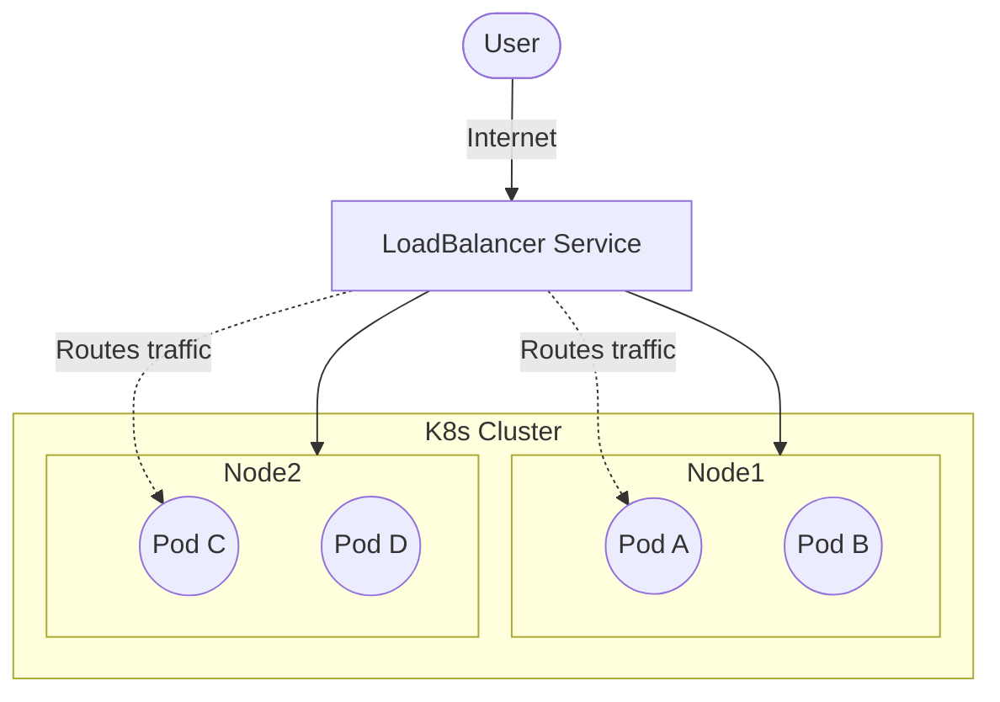
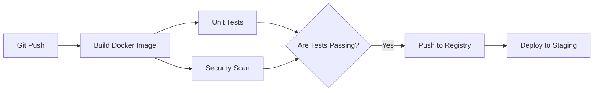

# 🔥 The Ultimate DevOps Interview Preparation Guide

This comprehensive guide breaks down essential DevOps tools, skills, and concepts tailored for interview preparation. The format ensures you can not only understand how these technologies work but also articulate their value to an interviewer.

---

## 🏗️ 1. Container Orchestration: Kubernetes (K8s)

Kubernetes is the industry standard for container orchestration. It automates the deployment, scaling, and operational management of containerized applications.

### 🧠 Core Concepts (What / How / When / Why)

#### a. Pods, Deployments & ReplicaSets
* **What:** 
  * **Pod:** The smallest deployable unit in Kubernetes. It typically hosts a single container.
  * **ReplicaSet:** Ensures a specific number of Pod replicas are running at any given time.
  * **Deployment:** A higher-level abstraction that manages ReplicaSets and provides declarative updates.
* **How:** You define a Deployment in YAML, specifying the container image and desired number of replicas. K8s does the rest.
* **When:** Use Deployments for all stateless applications. Avoid using loose Pods.
* **Why:** If a Node (server) crashes, the Deployment will automatically spin up replacement Pods on a healthy Node, ensuring high availability.

#### b. Services
* **What:** A logical abstraction that provides a stable IP address and DNS name to a set of Pods.
* **Types:**
  * **ClusterIP (Default):** Exposes the service internally within the cluster.
  * **NodePort:** Exposes the service on a static port on each Node's IP.
  * **LoadBalancer:** Provisions a cloud provider's external load balancer to expose the app.
* **How & Why:** Pods are ephemeral. Services provide a stable endpoint so other parts of your app never lose connection.

#### c. ConfigMaps & Secrets
* **What:** Objects used to inject configuration data and sensitive information into Pods. 
* **Why:** To safely decouple environment configuration from your container images.

#### d. Reliability & Scaling
* **Liveness Probe:** Checks if the app is *alive*. If it fails, K8s restarts the Pod.
* **Readiness Probe:** Checks if the app is *ready to serve traffic*. If it fails, K8s stops sending traffic to it.
* **HPA (Horizontal Pod Autoscaler):** Automatically scales the number of Pods up or down based on metrics.

### 🌐 Architecture Diagram

### 🛠️ Debugging Commands
* `kubectl get pods` - List running pods.
* `kubectl describe pod <pod-name>` - View detailed events and statuses.
* `kubectl logs <pod-name>` - View application stdout logs.
* `kubectl exec -it <pod-name> -- /bin/sh` - Opens a shell inside the container for deep debugging.

### 🎯 Interview Tips & Real-Life Scenarios
* **Scenario (Scaling):** *Interviewer: "Traffic spikes during a sale. How do you handle it?"* 
  * **Answer:** We configure a **Horizontal Pod Autoscaler (HPA)**. As CPU utilization crosses a threshold, HPA instructs the Deployment to increase the replica count. New Pods are automatically added behind the existing LoadBalancer.
* **Scenario (Deployment vs Pod):** *Interviewer: "Why not just create Pods directly?"* 
  * **Answer:** Pods are mortal. A Deployment provides a reconciliation loop to automatically correct drift by spinning up replacement pods if a node fails.

---

## 🏗️ 2. Infrastructure as Code (IaC): Terraform

Terraform is an IaC tool that allows you to define your cloud and on-premise resources in human-readable configuration files.

### 🧠 Core Concepts

#### a. Providers & Resources
* **Provider:** A plugin that allows Terraform to interact with cloud APIs (e.g., AWS, GCP). 
* **Resource:** Defines a single piece of infrastructure (e.g., an EC2 instance, an S3 bucket).
* **Variables:** Used to parameterize configurations (like passing in the environment name "dev" vs "prod").

#### b. The State File (`terraform.tfstate`)
* **What:** A JSON file where Terraform maps the real-world cloud resources to your configuration code.
* **Why:** Without it, Terraform wouldn't know if a resource already exists. It must be stored securely.

#### c. Key Commands
1. `terraform init` - Downloads the providers.
2. `terraform plan` - Shows you what *will* change.
3. `terraform apply` - Executes the changes.

### 🎯 Interview Tips
* **Question:** *Why Terraform over a manual UI?*
  * **Answer:** Version Control, Reproducibility, Auditing, and Automation in CI/CD.
* **Question:** *What is Idempotency?*
  * **Answer:** Running the same configuration multiple times will yield the exact same end state. It won’t blindly create ten servers if run ten times.

---

## ☁️ 3. Cloud (Amazon Web Services)

### 🧠 Core Concepts

#### a. Compute & Storage
* **EC2 (Elastic Compute Cloud):** Virtual machines rented in the cloud. You manage the OS.
* **S3 (Simple Storage Service):** Object storage used for backups, static assets, etc.

#### b. Networking Basics
* **VPC (Virtual Private Cloud):** Your secure, private isolated network inside AWS. 
* **Security Groups:** A virtual firewall at the **instance level**. E.g. "Allow HTTP from anywhere, SSH only from my IP".

### 🎯 Interview Tips & Setup
* **Scenario (EC2 vs Containers):** *Interviewer: "When would you use EC2 vs Containers?"*
  * **Answer:** EC2 is better for legacy apps that need a full OS or heavy databases. Containers are superior for modern microservices due to low overhead and millisecond boot times.
* **How you deploy an app on the cloud:**
  * I containerize the app -> Push it to a Registry -> Terraform provisions an EKS Cluster -> K8s pulls the image and runs the deployment.

---

## ⚙️ 4. CI/CD (Continuous Integration / Continuous Deployment)

### 🧠 Core Concepts

* **Pipeline Stages:** 
  1. **Build:** Compiling code, building Docker images.
  2. **Test:** Unit testing, integration testing.
  3. **Deploy:** Pushing code/images to an environment.
* **Parallel vs Sequential Jobs:** You want tests to run *in parallel* to save time. But Deploy must run *sequentially* after tests pass.
* **Deployment Strategies:**
  * **Rolling Update:** Replaces old versions linearly.
  * **Blue/Green:** You run two identical environments. You deploy the new version to Green, test it, and switch traffic over. Ensures rapid **rollbacks**.

### 🎯 Interview Tips
* **Scenario (Failure Handling):** *Interviewer: "A deployment fails in production. What's your process?"*
  * **Answer:** With a Blue/Green strategy, the rollback is instantaneous; switch traffic back. With standard updates, use Git to revert the commit to trigger a redeployment of the stable version.

---

## 📊 5. Observability & Monitoring

### 🧠 Core Concepts

* **The Three Pillars of Observability:**
  1. **Metrics:** Numerical data over time (e.g., CPU 80%). Handled by **Prometheus**.
  2. **Logs:** Immutable record of discrete events happening.
  3. **Traces:** Breadcrumbs a specific request leaves across microservices.
* **Alerting:** Using rules to push notifications. "If CPU > 90% for 5 mins, alert."

### 🎯 Interview Tips
* **Question:** *What metrics actually matter?*
  * **Answer:** The **Golden Signals**: Latency, Traffic, Errors, and Saturation.
* **Scenario:** *Interviewer: "Your app is slow, how do you debug?"*
  * **Answer:** Check Grafana Dashboard for latency anomalies. Look at application Logs around that timestamp. If microservices are involved, use Trace ID to find the bottleneck.

---

## 🔐 6. Security (DevSecOps)

### 🧠 Core Concepts
* **Dependency Scanning (Snyk):** Automatically checking if libraries have known vulnerabilities (CVEs) before merging to main.
* **Secret Management:** Never hardcode passwords in Git. Use tools like AWS Secrets Manager or K8s `Secrets`.

---

## 🐧 7. Linux & 🌐 8. Networking Basics

### 🧠 Linux Must-Knows
* **File Permissions:** `chmod`, `chown`. Understanding read, write, execute.
* **Process Management:** `ps aux` (list all processes), `kill -9 <PID>` (kill a process), `top` (view live resource usage).

### 🧠 Networking Basics
* **HTTP / HTTPS:** Application layer. HTTPS encrypts data in transit.
* **DNS (Domain Name System):** The internet's phonebook. Translates URLs to IPs.
* **Load Balancing:** Distributing network traffic across a group of servers to prevent bottlenecks.

### 🎯 Interview Tips
* **Question:** *What happens when you type google.com in the browser?*
  * **Answer:** 
    1. Browser checks local DNS cache. 
    2. Uses DNS resolver to get IP address.
    3. Initiates TCP 3-way handshake over port 443.
    4. TLS negotiation.
    5. Sends HTTP GET request.
    6. Server/LB routes it and returns HTTP 200 response.
