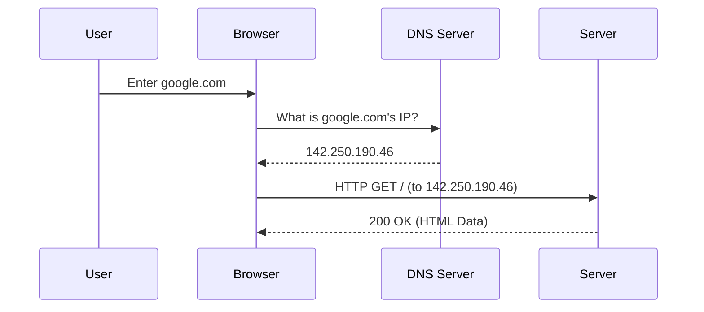
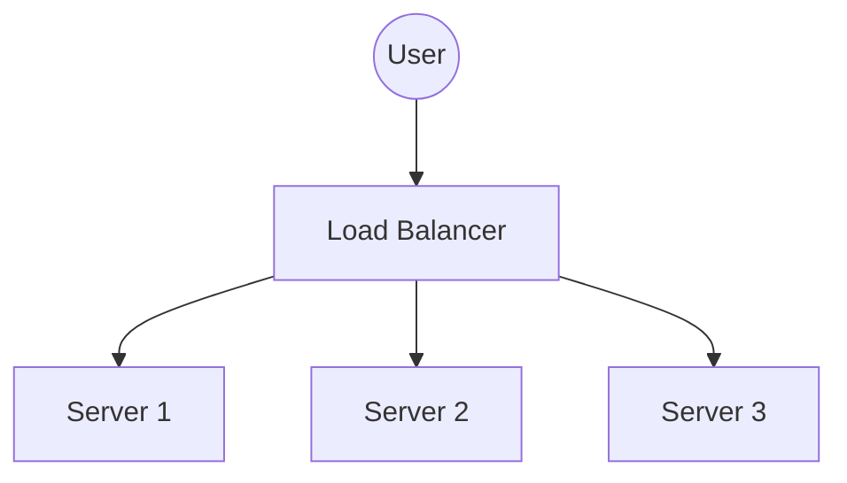
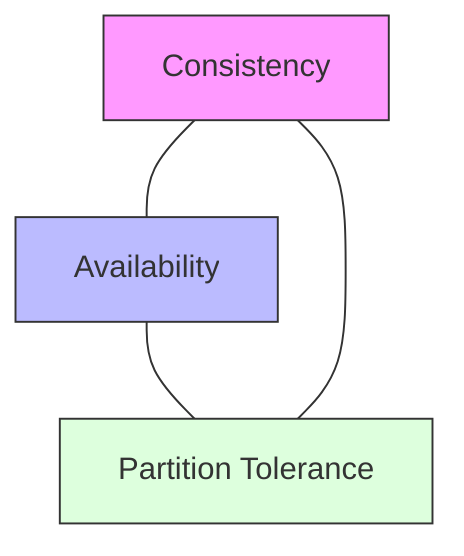
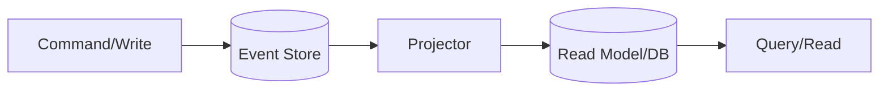
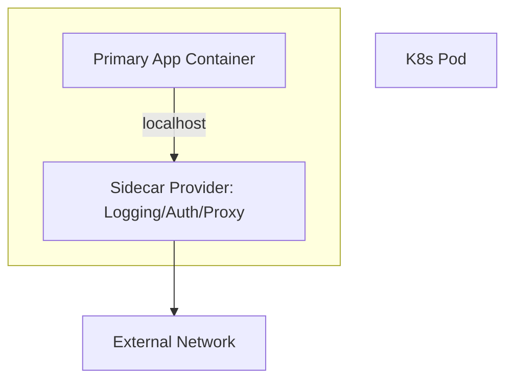
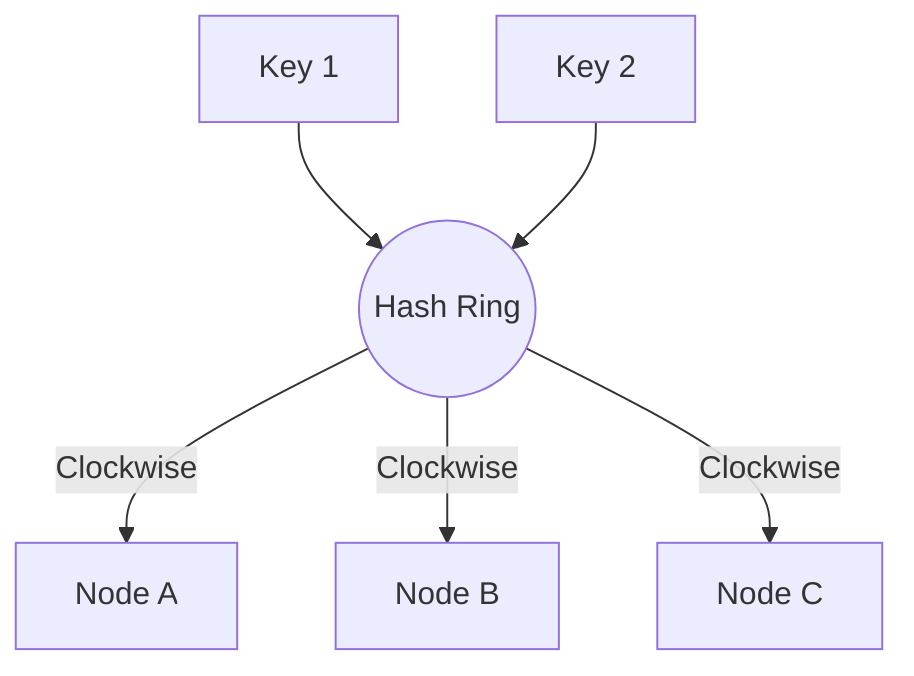
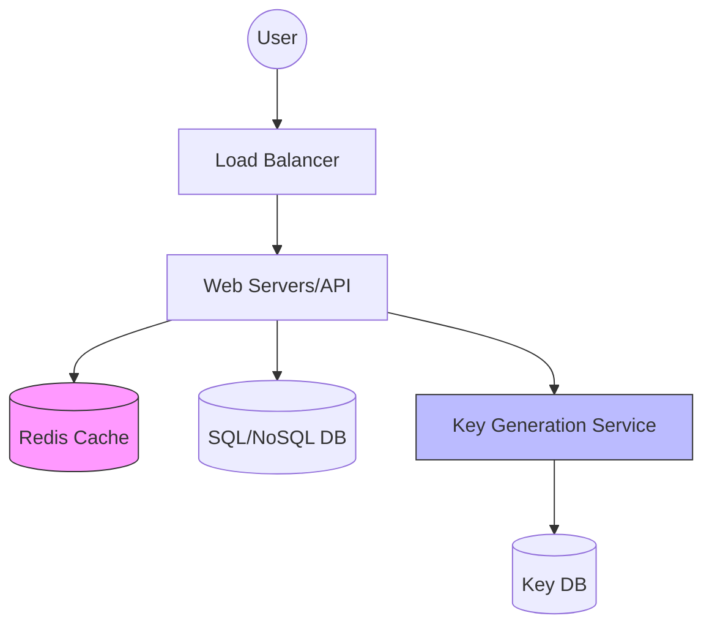
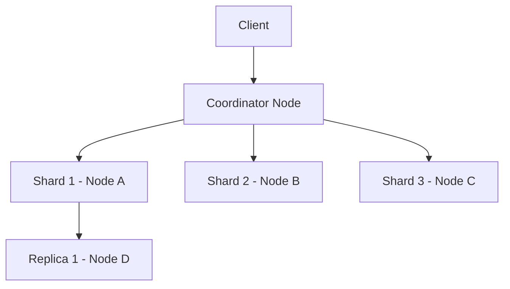

# 🌐 High-Level Design (HLD) Study Guide

This guide focuses on scaling systems to millions of users, transitioning from clean code (LLD) to robust system architecture.

---

## 🟢 Tier 1: The Beginner Level
**Focus:** The "Building Blocks" and the Request-Response cycle.

### 1. Client-Server Architecture & DNS
- **What**: The foundation of the web where a client (browser) requests resources from a server, using DNS to resolve domain names to IP addresses.
- **How**:
  - Browser queries DNS resolver for an IP (e.g., `google.com` -> `142.250.190.46`).
  - Establishing a TCP/TLS connection to that IP.
  - Sending HTTP requests and receiving responses.
- **When**: Every web interaction, from loading a page to submitting a form.
- **Why**: Decouples human-readable names from physical server addresses and enables global resource sharing.
- **Diagram**:

### 2. Load Balancers (L4 vs L7)
- **What**: A distribution layer that spreads traffic across multiple servers.
  - **L4 (Transport)**: Routes by IP/Port.
  - **L7 (Application)**: Routes by Content (URL, Headers, Cookies).
- **How**: Acts as a proxy, receiving requests and forwarding them to a healthy "upstream" server based on algorithms like Round Robin.
- **When**: When a single server can no longer handle the traffic volume or you need High Availability (HA).
- **Why**: Prevents server overload, provides a single entry point, and enables seamless horizontal scaling.
- **Diagram**:

### 3. Vertical vs. Horizontal Scaling
- **What**:
  - **Vertical (Scale Up)**: Adding more CPU/RAM to a single machine.
  - **Horizontal (Scale Out)**: Adding more machines to a cluster.
- **How**: 
  - **Vertical**: Hardware upgrades or increasing VM instance size.
  - **Horizontal**: Using an Autoscale Group and a Load Balancer to manage a pool of servers.
- **When**: 
  - **Vertical**: For small apps or databases that are hard to partition.
  - **Horizontal**: For large-scale distributed systems and microservices.
- **Why**: Horizontal scaling is preferred in HLD because it removes single points of failure and allows for virtual infinite growth.

### 4. Database Basics: SQL vs. NoSQL
- **What**:
  - **SQL**: Relational databases (PostgreSQL) with strict schemas and ACID compliance.
  - **NoSQL**: Non-relational (MongoDB, Redis) with flexible schemas and high write throughput.
- **How**: SQL uses tables and joins; NoSQL uses documents, key-values, or columns.
- **When**: 
  - **SQL**: For financial transactions and complex relationship querying.
  - **NoSQL**: For massive log data, real-time feeds, or unstructured content.
- **Why**: SQL ensures data integrity; NoSQL provides low-latency scale and schema flexibility.

### 5. Caching & CDNs
- **What**: Caching stores data in-memory (RAM) for fast access; CDNs are distributed caches for static assets near the user.
- **How**: Checks the cache first (**Cache Hit**); if missing (**Cache Miss**), fetches from the source and stores it in the cache with a **TTL**.
- **When**: For frequently accessed data or high-traffic static files (images, JS).
- **Why**: Drastically reduces latency and server load by serving data from the nearest or fastest memory source.

### 6. API Foundations & Interaction (REST vs GraphQL)
- **What**: Standards for how services talk to each other.
  - **REST**: Stateless, resource-oriented.
  - **GraphQL**: Query-based fetching for specific fields.
- **How**: REST uses HTTP verbs (GET, POST); GraphQL uses a single endpoint and a query schema.
- **When**: 
  - **REST**: For public APIs and simple resources.
  - **GraphQL**: For complex frontend dashboards needing specific, nested data.
- **Why**: Efficiency—REST is easy and cacheable; GraphQL prevents over-fetching/under-fetching.

### 7. Proxy vs. Reverse Proxy
- **What**: 
  - **Proxy (Forward)**: Acts on behalf of a client.
  - **Reverse Proxy**: Acts on behalf of a server.
- **How**: Positioned between client and server to intercept, filter, or re-route traffic.
- **When**: 
  - **Proxy**: To mask user identity or bypass firewalls.
  - **Reverse Proxy**: For SSL termination, Load Balancing, and Cache offloading.
- **Why**: Security and performance—hiding internal server IPs and centralizing cross-cutting concerns.

### 8. API Versioning & Idempotency
- **What**: Practices to ensure API stability and safety during retries.
- **How**: Versioning via URL (`/v1`) or headers; Idempotency via unique keys in headers.
- **When**: When deploying breaking changes or processing critical actions like payments.
- **Why**: Prevents breaking existing clients (Versioning) and prevents duplicate execution of the same request (Idempotency).

---

## 🟡 Tier 2: The Intermediate Level
**Focus:** Availability, Reliability, and Data Consistency.

### 1. The CAP Theorem & BASE
- **What**: 
  - **CAP**: Consistency, Availability, Partition Tolerance.
  - **BASE**: Basically Available, Soft state, Eventual consistency.
- **How**: Systems prioritize two out of three (usually AP or CP in distributed contexts). NoSQL systems like Cassandra use BASE for eventual consistency.
- **When**:
  - **CP**: When data accuracy is critical (Banking).
  - **AP**: When uptime is more important than immediate consistency (Social media feed).
- **Why**: Proves that a distributed system cannot guarantee all three simultaneously; forcing a trade-off.
- **Diagram**:

### 2. Database Deep Dive (ACID, Isolation, Normalization)
- **What**: Core concepts for data integrity and storage optimization.
  - **ACID**: Atomicity, Consistency, Isolation, Durability.
  - **Isolation Levels**: Read Uncommitted to Serializable.
  - **Normalization**: Reducing redundancy.
- **How**: Using transaction logs, locking mechanisms, and dividing tables into logical entities.
- **When**: 
  - **ACID**: For every mission-critical data write.
  - **Denormalization**: When read performance (joins) becomes the bottleneck.
- **Why**: Ensures that data remains consistent even during crashes and optimizes the balance between storage and speed.

### 3. Database Scaling (Replicas & Sharding)
- **What**:
  - **Replication**: Copying data across nodes.
  - **Sharding**: Splitting data into horizontal partitions.
- **How**: 
  - **Replication**: Master-Slave or Multi-Master setups.
  - **Sharding**: Using a shard key (e.g., `user_id % 10`) to determine where data lives.
- **When**: 
  - **Replicas**: When read volume is high.
  - **Sharding**: When a single database exceeds storage or write throughput limits.
- **Why**: Prevents the database from becoming a central bottleneck in high-scale systems.

### 4. Messaging Taxonomy (Queue, Broker, Pub-Sub, Bus)
- **What**: Systems for asynchronous communication between services.
- **How**:
  - **Message Queue (1:1)**: Producer sends to a queue; one consumer picks it up.
  - **Pub-Sub (1:N)**: Producer broadcasts to a topic; many subscribers receive it.
- **When**: To decouple services, buffer spikes in traffic (Load Leveling), and handle slow background processes.
- **Why**: Increases system resilience (if one service is down, the message stays in the queue) and improves user experience by returning faster.
- **Comparison Key**:
| Concept | Primary Goal | Delivery Model | Example |
| :--- | :--- | :--- | :--- |
| **Message Queue** | Work distribution | Point-to-Point (1:1) | RabbitMQ, SQS |
| **Pub-Sub** | Event broadcast | One-to-Many (1:N) | Kafka, SNS |

### 5. Storage & Processing (Blobs & Streams)
- **What**: 
  - **Blob Storage**: Storing large unstructured files (images/videos).
  - **Streaming**: Constant flow of data (logs/metrics).
- **How**: 
  - **Blob**: Using services like AWS S3.
  - **Stream**: Using Kafka or Spark Streaming.
- **When**: 
  - **Blob**: For media storage.
  - **Stream**: For real-time fraud detection or live dashboards.
- **Why**: Optimized storage for non-relational files and real-time insights from data-in-motion.

### 6. Microservices: Patterns & Challenges
- **What**: Architectural style that decomposes a monolith into small, independent services.
- **How**: Using **API Gateways** for entry, **Service Discovery** for finding endpoints, and **Circuit Breakers** for handling failures.
- **When**: When the team size grows and the monolith becomes too complex to deploy frequently.
- **Why**: Faster deployments, independent scaling, and fault isolation.

### 7. Caching Strategies & Deep-Dive
- **What**: Advanced techniques for managing data in high-speed memory.
- **How**: 
  - **Write-Through**: Write to cache and DB together.
  - **LRU Eviction**: Deleting the least recently used keys.
- **When**: 
  - **Cache Warming**: Before a big launch.
  - **Stampede Prevention**: When a hot key expires.
- **Why**: Ensures high performance under load and prevents the "Thundering Herd" effect on the primary database.

### 8. Communication Protocols (Websockets, SSE, gRPC, Polling)
- **What**: Methods for servers and clients to exchange data beyond standard HTTP.
- **How**: 
  - **Websockets**: Persistent full-duplex connection.
  - **gRPC**: Binary protocol using Protocol Buffers.
- **When**: 
  - **Websockets**: Real-time chat.
  - **SSE**: Live stock tickers.
- **Why**: Efficiency—reducing header overhead and providing lower latency for real-time updates.

### 9. Security Foundations (WAF, Auth, JWT)
- **What**: Protecting the system from attacks and managing user access.
- **How**: 
  - **WAF**: Filtering malicious HTTP traffic.
  - **JWT**: Stateless tokens for authenticating users.
- **When**: Essential for every public-facing system.
- **Why**: Protects user data, prevents DDoS, and ensures non-repudiation.

---

## 🔴 Tier 3: The Advanced Level
**Focus:** Global Scalability, Fault Tolerance, and Observability.

### 1. Distributed Consensus: Paxos & Raft
- **What**: Algorithms that allow a group of nodes to agree on a single value or state despite network failures.
- **How**: 
  - **Raft**: Uses leader election and log replication. A majority (quorum) must agree before a write is committed.
- **When**: When building highly available coordination services or distributed databases (e.g., Zookeeper, Etcd).
- **Why**: Ensures that the system remains consistent and operational even if some nodes fail.

### 2. High-Performance Data Flow: LSM Trees vs. B-Trees
- **What**: 
  - **B-Trees**: Multi-level tree structure optimized for disk reads (SQL).
  - **LSM Trees**: Log-structured merge-trees optimized for disk writes (NoSQL).
- **How**: 
  - **B-Trees**: Update in-place on disk.
  - **LSM Trees**: Write to memory first (SSTables) and periodically merge/compact to disk.
- **When**: 
  - **B-Trees**: For read-heavy relational workloads.
  - **LSM Trees**: For write-intensive systems like log aggregators or time-series databases.
- **Why**: B-Trees provide faster random reads; LSM Trees provide superior sequential write performance.

### 3. Distributed Transactions (2PC vs. 3PC vs. Saga)
- **What**: Methods for ensuring atomic "all-or-nothing" operations across multiple databases or services.
- **How**: 
  - **2PC**: Prepare phase and Commit phase managed by a coordinator.
  - **Saga**: A sequence of local transactions with compensation logic if one fails.
- **When**: 
  - **2PC**: When strong consistency is non-negotiable within a cluster.
  - **Saga**: Preferred in microservices for long-running business processes.
- **Why**: Prevents partial data updates and maintains system-wide integrity.

### 4. Distributed Systems: Consistency & Concurrency
- **What**: 
  - **Linearizability**: The illusion of a single copy of data.
  - **Concurrency Control**: Managing simultaneous access to the same record (Locking vs OCC).
- **How**: Using **Optimistic Locking** (version checks) or **Pessimistic Locking** (DB locks).
- **When**: 
  - **Optimistic**: For high-concurrency, low-contention workloads.
  - **Pessimistic**: For high-risk, high-contention data like bank balances.
- **Why**: Balances the trade-off between strict data correctness and system performance.

### 5. Patterns: Webhooks, Service Discovery, & Failover
- **What**: 
  - **Webhooks**: Automated push-notifications from a server to a client.
  - **Service Discovery**: A dynamic registry of available service instances.
- **How**: 
  - **Health Checks**: Automatically detecting and removing dead service instances.
  - **Failover**: Rerouting traffic to a standby node.
- **When**: 
  - **Webhooks**: For external payment confirmations (Stripe).
  - **Discovery**: In every modern containerized environment (K8s).
- **Why**: Essential for building self-healing and elastic distributed systems.

### 6. Observability: Monitoring, Logging, & Tracing
- **What**: Tools to understand the internal state of a system from its external outputs.
- **How**: 
  - **Logging**: Centalized event stream (ELK).
  - **Tracing**: Attaching a unique ID to a request to track it across services (Jaeger).
- **When**: From day one of development to find bottlenecks and debug production issues.
- **Why**: Turns a "black box" system into a transparent one, allowing for faster incident response.

### 7. Global Scalability: Blockchain & Consistent Hashing
- **What**: 
  - **Consistent Hashing**: A hashing scheme that minimizes re-mapping when nodes are added/removed.
  - **Blockchain**: A decentralized, immutable ledger.
- **How**: Consistent hashing uses a hash-ring to distribute keys across nodes.
- **When**: 
  - **Hashing**: For distributed caching (Redis) or sharded databases.
  - **Blockchain**: When trust is decentralized (supply chain, currency).
- **Why**: Hashing enables elastic scaling without massive data migration; Blockchain enables trustless transparency.

### 8. System Qualities (The "Abilities")
- **What**: The non-functional requirements that define a system's quality.
- **How**: Measured through latency (p99), uptime percentages (99.9%), and throughput (RPS).
- **When**: These must be defined during the **Requirement Distinction** phase of design.
- **Why**: Determines the business value and user satisfaction of the technical architecture.

---

## 💎 Tier 4: Principal Level (Mastery & Distributed DNA)

### 1. Architectural Patterns & High-Level Styles
- **1. Monolith vs. Microservices**:
  - **What**: Monolith is a single unified unit; Microservices are independent, specialized units.
  - **How**: Monolith uses internal function calls; Microservices use network calls (REST/gRPC).
  - **When**: Monolith for early-stage speed; Microservices for scaling large teams and high-complexity domains.
  - **Why**: Microservices enable independent scaling and fault isolation but add network complexly.
- **2. Serverless (FaaS)**:
  - **What**: Event-driven execution model where the provider manages server allocation.
  - **How**: Code runs in ephemeral containers triggered by events (HTTP, S3 upload).
  - **When**: For unpredictable workloads or small background tasks.
  - **Why**: Zero maintenance and auto-scale to zero, saving costs.
- **3. Event-Driven (EDA) & Pub-Sub**:
  - **What**: Architecture where decoupled services communicate via events.
  - **How**: Using a Message Broker (Kafka) to produce and consume event streams.
  - **When**: For real-time updates and highly decoupled systems.
  - **Why**: Extreme scalability and responsiveness.
- **4. CQRS & Event Sourcing**:
  - **What**: CQRS separates Read and Write models; Event Sourcing stores every state change as an immutable event.
  - **How**: Writing to an 'Append-Only' log and projecting state into a Read database.
  - **When**: For complex domains like Banking or Audit-trailed systems.
  - **Why**: High performance on reads and 100% accurate history/auditability.
  - **Diagram**:

- **5. Hexagonal / Clean Architecture**:
  - **What**: Decoupling core business logic from external concerns (DB, UI).
  - **How**: Using Interfaces (Ports) and Implementations (Adapters).
  - **When**: When the system must be easily testable and swap-able (e.g., changing DBs).
  - **Why**: Framework independence and clean testability.
- **6. Sidecar & Ambassador Patterns**:
  - **What**: Helper containers that run alongside a primary service.
  - **How**: Sidecar handles logging/security; Ambassador handles network routing.
  - **When**: In Kubernetes/Service Mesh environments.
  - **Why**: Offloads cross-cutting concerns from the application code.
  - **Diagram**:

- **7. Migration Patterns (Strangler Fig)**:
  - **What**: Incrementally replacing system functionality.
  - **How**: Placing a Proxy in front and routing new features to new services.
  - **When**: Moving from Monolith to Microservices.
  - **Why**: Reduces risk by avoiding "Big Bang" rewrites.
- **8. Sagas (Choreography vs. Orchestration)**:
  - **What**: Managing long-running transactions across microservices.
  - **How**: Sequential local transactions with compensation logic.
  - **When**: When 2PC is too slow for distributed workflows.
  - **Why**: Ensures eventual consistency without blocking resources.
- **9. Bulkhead & Resiliency Patterns**:
  - **What**: Isolating resources to prevent a total system crash.
  - **How**: Allocating fixed thread pools or instances per service.
  - **When**: When one failing service might exhaust resources of the entire cluster.
  - **Why**: Improves system stability through compartmentalization.
- **10. Big Data Styles (Lambda vs. Kappa)**:
  - **What**: Lambda uses Batch + Speed layers; Kappa uses only Stream processing.
  - **How**: Lambda re-processes everything in batch; Kappa treats everything as a stream.
  - **When**: For real-time analytics at petabyte scale.
  - **Why**: Lambda is robust; Kappa is simpler and lower latency.

- **11. Shared-Nothing Architecture**:
  - **What**: Distributed computing model where each node is independent and self-sufficient.
  - **How**: Logic and data are partitioned so nodes don't share memory or disk.
  - **When**: For massive scale systems like Google Search or Bigtable.
  - **Why**: Eliminates central bottlenecks and maximizes horizontal scalability.
- **12. Backend-for-Frontend (BFF)**:
  - **What**: Creating specialized backend services for specific client types (Mobile vs Web).
  - **How**: Deploying separate gateway services tailored to the client's data needs.
  - **When**: When different clients have vastly different UI/UX and data requirements.
  - **Why**: Reduces client logic complexity and minimizes over-fetching.

### 2. Scalability & Traffic Management
- **1. Advanced Load Balancing Algorithms**:
  - **What**: Logic used to select the next server (Weighted Round Robin, Least Connections, IP Hash).
  - **How**: 
    - **WRR**: Gives more traffic to powerful servers.
    - **IP Hash**: Ensures a specific user IP always hits the same server.
  - **When**: When servers have uneven hardware or you need session persistence without sticky cookies.
  - **Why**: Optimizes resource utilization and ensures deterministic routing.
- **2. GSLB, Anycast & Geo-DNS**:
  - **What**: Global traffic routing techniques.
  - **How**: 
    - **Geo-DNS**: Returns IP closest to the user's region.
    - **Anycast**: Multiple servers share the same IP; BGP routes you to the "closest" node.
  - **When**: For ultra-low latency global applications.
  - **Why**: Minimizes the speed-of-light delay and provides automatic regional failover.
- **3. Hash Slots vs. Consistent Hashing**:
  - **What**: Advanced data partitioning. 
  - **How**: Redis uses **Hash Slots** (16383 fixed slots); Cassandra uses **Consistent Hashing** (Hash ring).
  - **When**: When building elastic key-value stores.
  - **Why**: Consistent hashing minimizes data movement during re-scaling; Hash slots are simpler to manage at scale.
  - **Diagram (Hash Ring)**:

- **4. Edge Computing & CDNs**:
  - **What**: Moving computation as close to the user as possible.
  - **How**: Running Lambda functions at the CDN edge nodes (e.g., Cloudflare Workers).
  - **When**: For real-time transformations, header manipulation, or localized logic.
  - **Why**: Offloads origin server and reduces round-trip time (RTT).
- **5. Rate Limiting Deep-Dive (Bucket vs. Window)**:
  - **What**: Algorithms like Token Bucket, Leaky Bucket, and Sliding Window.
  - **How**: 
    - **Leaky Bucket**: Smooths out bursts to a constant rate.
    - **Sliding Window**: Provides precise limits without the "double-rate" spike of fixed windows.
  - **When**: To protect against DDoS, noisy neighbors, or API monetization.
  - **Why**: Protects system availability and enforces fair-usage.
- **6. Health Checks, Heartbeats & Heartbeat Mechanism**:
  - **What**: Detecting failures in a cluster.
  - **How**: Liveness/Readiness probes (HTTP 200) and periodic packet/ping (Heartbeat).
  - **When**: Essential for Service Discovery and automated Failover.
  - **Why**: Prevents "blackhole" routing (sending traffic to dead servers).
- **7. Connection Pooling & Sticky Sessions**:
  - **What**: Optimizing network connections.
  - **How**: Reusing a set of open DB/Service connections instead of creating new ones for every request.
  - **When**: When connection overhead (TCP/TLS handshake) is the bottleneck.
  - **Why**: Significant latency reduction and database resource preservation.
- **8. SSL Termination vs. SSL Passthrough**:
  - **What**: Where the encryption is decrypted.
  - **How**: Termination at the Load Balancer (unencrypted inside VPC); Passthrough all the way to the server.
  - **When**: Termination for performance; Passthrough for high-security compliant data (PII/HIPAA).
  - **Why**: Termination simplifies certificate management and offloads CPU-heavy crypto.
- **9. Deployment Strategies (Blue-Green vs. Canary)**:
  - **What**: Risk-managed code releases.
  - **How**: 
    - **Blue-Green**: Switch 100% traffic from old (Blue) to new (Green) environment.
    - **Canary**: Route 5% traffic to a small "canary" group of new servers first.
  - **When**: To avoid downtime and catch bugs before they impact all users.
  - **Why**: Enables confident, continuous deployment and instant rollback.
- **10. Backpressure & Flow Control**:
  - **What**: Forcing the producer to slow down when the consumer is overwhelmed.
  - **How**: Using buffer limits or signaling the producer (e.g., TCP Flow Control).
  - **When**: In high-throughput streaming systems like Kafka or reactive streams.
  - **Why**: Prevents system "melting" and memory exhaustion during traffic spikes.

### 3. Database & Storage Mastery
- **1. PACELC Theorem**:
  - **What**: Extension of CAP. If Partition (P), trade-off Availability (A) vs Consistency (C); Else (E), trade-off Latency (L) vs Consistency (C).
  - **How**: Configurable settings in DynamoDB or Cassandra.
  - **When**: When normal operation latency is just as important as partition resilience.
  - **Why**: Proves that even without failures, we trade consistency for speed.
- **2. B-Tree vs. LSM Trees**:
  - **What**: Primary storage engine structures.
  - **How**: B-Trees (SQL) update in-place; LSM Trees (NoSQL) use append-only SSTables and compaction.
  - **When**: B-Trees for read-heavy; LSM for write-heavy.
  - **Why**: Sequential writes (LSM) are orders of magnitude faster than random writes (B-Tree) on spinning disks/standard SSDs.
- **3. Database Indexing (Covering & Composite)**:
  - **What**: Optimized search structures.
  - **How**: 
    - **Covering**: Index contains all data for the query (no DB hit needed).
    - **Composite**: Index on multiple columns (e.g., `last_name, first_name`).
  - **When**: To optimize slow queries and avoid "Full Table Scans".
  - **Why**: Drastically reduces I/O by finding data in the index tree instead of the main table.
- **4. Quorum-based Writes & Quorum reads**:
  - **What**: Distributed consensus for state changes (`W + R > N`).
  - **How**: A majority of nodes must confirm a write before success.
  - **When**: In "Leaderless" replication systems like Dynamo or Cassandra.
  - **Why**: Guarantees strong consistency in a distributed environment without a primary leader.
- **5. Database Sharding & The Celebrity Problem**:
  - **What**: Horizontal partitioning of data.
  - **How**: Range, Hash, or Directory sharding.
  - **When**: When a single node bottleneck is reached. **Hot Partition (Celebrity)** occurs when one key (Justin Bieber) gets 90% of traffic.
  - **Why**: Sharding enables infinite write-scale. Celebrity problems require sub-sharding or caching.
- **6. Specialized DBs (Vector, Time-series, Spatial)**:
  - **What**: Databases built for non-standard math/data types.
  - **How**: Vector DBs (Pinecone) use embeddings; Spatial (PostGIS) use Geohashes.
  - **When**: For AI search, IoT logs, or "Find drivers near me".
  - **Why**: General SQL is too slow for high-dimensional or geographic math at scale.
- **7. Change Data Capture (CDC) & WAL Shipping**:
  - **What**: Streaming DB updates to other services.
  - **How**: Tailing the transaction log (WAL) and sending events to Kafka (Debezium).
  - **When**: For keeping a Search Index (ES) or Cache in sync with the primary DB.
  - **Why**: Decouples the DB and ensures high-consistency between different data stores.
- **8. Cloud Storage Tiers (Object, Block, File, Cold)**:
  - **What**: Categorization of storage by access speed and cost.
  - **How**: S3 (Object) for files; EBS (Block) for DB disks; Glacier (Cold) for archives.
  - **When**: To optimize infrastructure costs.
  - **Why**: Don't pay "Block" prices for "Cold" data.
- **9. Data Warehousing vs. Data Lakes (ETL vs ELT)**:
  - **What**: Historical analytical storage.
  - **How**: Warehouses (Snowflake) are structured; Lakes (S3) are raw.
  - **When**: For Business Intelligence (BI) and Data Science.
  - **Why**: ETL cleanses data first; ELT stores raw data and transforms it during analysis (Schema-on-read).
- **10. PITR & TCC (Distributed Transactions)**:
  - **What**: Point-in-time recovery and Try-Confirm-Cancel.
  - **How**: PITR uses WAL + Snapshots; TCC is an application-level distributed commit pattern.
  - **When**: Financial apps needing exact state recovery and atomic multi-resource updates.
  - **Why**: Prevents data loss and ensuring atomicity in microservices without blocking.

---

### 4. Caching & Performance
- **1. Cache Eviction (LRU, LFU, FIFO)**:
  - **What**: Algorithms to decide what to delete when the cache is full.
  - **How**: 
    - **LRU**: Delete Least Recently Used.
    - **LFU**: Delete Least Frequently Used (Better for long-term hot keys).
  - **When**: Always tune based on your traffic pattern.
  - **Why**: Maintains high cache hit rates and prevents the cache from becoming a memory leak.
- **2. Cache Strategies (Write-through, Write-back, Write-around)**:
  - **What**: How data flows into the cache vs. DB.
  - **How**: 
    - **Write-back**: Write to cache first, write to DB later (Fastest).
    - **Write-around**: Write to DB only; cache only on read miss.
  - **When**: Use Write-around to avoid flooding the cache with "one-off" writes.
  - **Why**: Balances speed vs. consistency.
- **3. Cache Failure Patterns (Penetration, Breakdown, Avalanche)**:
  - **What**: Catastrophic cache failures.
  - **How**: 
    - **Penetration**: Requesting non-existent keys (Solution: Bloom Filters/Negative Caching).
    - **Breakdown**: Hot key expires (Solution: Locks/Cache Warming).
    - **Avalanche**: All keys expire at once (Solution: Jitter/Random TTL).
  - **When**: Critical for high-scale systems to prevent "Database Smashing".
  - **Why**: Essential for production stability.
- **4. Memoization & Content Addressable Storage**:
  - **What**: Performance optimizations at the function and storage layer.
  - **How**: Memoization caches function results in RAM; CAS uses hashes as keys (IPFS).
  - **When**: Memoization for complex math; CAS for de-duplicating files globally.
  - **Why**: Eliminates redundant computation and storage.
- **5. Serialization & Compression (Protobuf vs JSON)**:
  - **What**: How data is formatted for the wire.
  - **How**: JSON is human-readable (text); Protobuf is binary (fast/small).
  - **When**: Use Protobuf for internal service communication (gRPC).
  - **Why**: Reduces CPU cost of parsing and minimizes network bandwidth.

### 5. Communication & Networking
- **1. HTTP 1.1 vs. 2.0 vs. 3.0 (QUIC)**:
  - **What**: Evolution of the web's primary protocol.
  - **How**: 
    - **HTTP/1.1**: Multiple TCP connections (Head-of-line blocking).
    - **HTTP/2**: Binary framing, Multiplexing over one TCP.
    - **HTTP/3**: Based on QUIC (UDP), removes TCP head-of-line blocking.
  - **When**: Always prefer HTTP/3 for mobile apps and high-latency networks.
  - **Why**: Drastically reduces page load times and improves resilience to packet loss.
- **2. gRPC vs. REST vs. GraphQL**:
  - **What**: Communication styles for modern services.
  - **How**: 
    - **gRPC**: Binary (Protobuf), strict types, streaming.
    - **GraphQL**: Schema-first, query-level field selection.
  - **When**: gRPC for internal microservices; GraphQL for complex frontend data needs.
  - **Why**: gRPC is 10x faster than REST; GraphQL prevents over-fetching.
- **3. Messaging Semantics (Exactly-once vs. At-least-once)**:
  - **What**: Guarantees on message delivery.
  - **How**: Using ACKs, Deduplication ids, and Idempotent producers.
  - **When**: **Exactly-once** for banking/billing; **At-least-once** for log aggregation.
  - **Why**: "Exactly-once" is the hardest problem in distributed systems and adds latency/overhead.
- **4. Message Ordering & Partition Keys**:
  - **What**: Ensuring events happen in the sequence they were sent.
  - **How**: In Kafka, messages with the same **Partition Key** go to the same shard/partition.
  - **When**: For ledger updates or state machines where order matters.
  - **Why**: Without keys, messages are distributed round-robin and can be processed out of order.
- **5. Zero-copy Networking & Service Mesh**:
  - **What**: Ultra-high performance networking.
  - **How**: 
    - **Zero-copy**: Passing pointers instead of copying data buffers in memory.
    - **Service Mesh**: Using a Sidecar (Istio) to handle mTLS and circuit breaking.
  - **When**: For high-throughput storage systems or complex microservice fleets.
  - **Why**: Zero-copy saves CPU cycles; Service Mesh decouples infrastructure from code.

---

### 6. Distributed Systems Theory & Resilience
- **1. Clock Skew & Logical Clocks (Lamport/Vector)**:
  - **What**: Ordering events in a system where physical clocks aren't synchronized.
  - **How**: **Vector Clocks** track causality by maintaining a version per node.
  - **When**: When "What happened first?" matters for conflict resolution (e.g., shopping cart merges).
  - **Why**: Physical clocks drift; logical clocks ensure causal ordering.
- **2. Distributed Consensus (Paxos vs. Raft)**:
  - **What**: Getting $N$ nodes to agree on a single value.
  - **How**: Raft uses Leader Election and Log Replication with Quorum.
  - **When**: For highly available state machines (Etcd/Consul).
  - **Why**: Foundation of all distributed consistency and high availability.
- **3. Gossip Protocol & Heartbeats**:
  - **What**: Decentralized failure detection and state propagation.
  - **How**: Nodes randomly share information with neighbors (Epidemic broadcasting).
  - **When**: In massive clusters (Cassandra/Dynamo) where a central registry is a bottleneck.
  - **Why**: High scalability and no single point of failure.
- **4. Fencing Tokens & Distributed Locking**:
  - **What**: Preventing "Split Brain" or overlapping updates.
  - **How**: Redlock (Redis) or Fencing Tokens (monotonically increasing IDs).
  - **When**: When multiple workers might try to perform the same exclusive task.
  - **Why**: Prevents data corruption during network partitions or process freezes (Stop-the-world GC).
- **5. Chaos Engineering & Disaster Recovery (RTO/RPO)**:
  - **What**: Testing resilience and planning for catastrophe.
  - **How**: Injecting failures (Chaos Monkey) and defining RTO (Recovery Time) and RPO (Data Loss window).
  - **When**: Essential for enterprise-grade "Always On" systems.
  - **Why**: You don't know if your system is resilient until you break it on purpose.

---

### 7. Security & Infrastructure Mastery
- **1. OAuth 2.0 / OIDC & JWT**:
  - **What**: Federated identity and stateless authentication.
  - **How**: JWTs carry claims in a signed header/payload.
  - **When**: For single sign-on (SSO) and microservice auth.
  - **Why**: Statelessness allows for infinite horizontal scaling of the Auth service.
- **2. RBAC vs. ABAC**:
  - **What**: 
    - **RBAC**: Role-Based Access Control (Admin, User).
    - **ABAC**: Attribute-Based (Is user in Dept X and time is 9-5?).
  - **When**: ABAC for enterprise complex security requirements.
  - **Why**: ABAC is more granular and flexible than static roles.
- **3. Multi-tenancy Models**:
  - **What**: Serving multiple customers (tenants) from one system.
  - **How**: Shared DB vs. Separate Schemas vs. Separate Clusters.
  - **When**: Core design for SaaS (Software as a Service) platforms.
  - **Why**: Shared DB is cheaper; Separate Clusters are more secure and isolated.
- **4. Secrets Management & Zero Trust**:
  - **What**: Protecting API keys and internal communication.
  - **How**: Using Vault for secrets and mTLS (Mutual TLS) for all service-to-service calls.
  - **When**: Standard for modern cloud security.
  - **Why**: Assumes the internal network is already compromised (Default Deny).
- **5. Infrastructure as Code (IaC) & Orchestration**:
  - **What**: Defining hardware in code.
  - **How**: Terraform (Provisioning) and Kubernetes (Containers).
  - **When**: Essential for reproducible environments and autoscaling.
  - **Why**: Eliminates "Snowflake Servers" and manual configuration errors.

---

## 🚀 HLD Bonus: Capacity Estimation & SLA

### 1. SLA / SLO / SLI
- **What**: Agreements, Objectives, and Indicators of system health.
- **How**: Measured in "Nines" (e.g., 99.99%).
- **When**: For customer contracts and internal SRE alerting.
- **Why**: Defines the balance between innovation speed and system stability (Error Budget).

### 2. Back-of-the-envelope Estimation
- **What**: Rapid calculation of Storage, Bandwidth, and CPU needs.
- **How**: **DAU** $\times$ **Requests** $\times$ **Duration**.
- **When**: Always start an HLD interview with this.
- **Why**: High-level sanity check—does your design fit on one server or one thousand?

### 3. Distributed ID Generation
- **What**: Unique, non-colliding IDs across machines (Snowflake).
- **How**: Timestamp (41 bits) + Machine ID (10 bits) + Sequence (12 bits).
- **Why**: Avoids central DB bottlenecks and ensures time-sortable IDs.

---

## 📋 System Design Interview Checklist
1. **Requirements**: Clarify Functional & Non-Functional (p99 latency, RPS).
2. **Estimation**: DAU, Storage, Bandwidth (Back-of-the-envelope).
3. **API Design**: Endpoint definitions (REST/GraphQL).
4. **Data Modeling**: Schema design (SQL/NoSQL) & Indexing.
5. **High-Level Diagram**: Load Balancers, Gateways, Services, Caches, DBs.
6. **Detailed Deep-Dives**: Consistency, Replication, Sharding, Failure handling.
7. **Bottlenecks/Optimizations**: Rate Limiting, CDNs, Observability.
---

## 🏗️ System Design Case Studies

### 1. Design a URL Shortener (TinyURL)
- **What**: A service that converts long URLs into short, human-readable codes.
- **How**: 
  1. Use **Base62 encoding** on an auto-incrementing counter.
  2. Use a **NoSQL Key-Value store** for fast lookups.
  3. Cache hot URLs in **Redis**.
- **When**: For improving UX and tracking link analytics globally.
- **Why**: Low-latency redirection and high-write throughput are the primary goals.
- **Architecture Diagram**:

### 2. Design a Rate Limiter
- **What**: A system component that limits the number of requests a user can make within a time window.
- **How**: 
  - **Token Bucket**: Allows bursts; efficient for varying traffic.
  - **Redis Implementation**: Use atomic `INCR` or Lua scripts to track user count.
- **When**: To prevent API abuse (DDoS), manage server costs, and ensure fair usage.
- **Why**: Protects the backend from being overwhelmed by malicious or buggy clients.

### 3. Design a Distributed Search System (Elasticsearch style)
- **What**: A system capable of full-text search across billions of documents with millisecond latency.
- **How**: 
  1. Use an **Inverted Index** (mapping words to doc IDs).
  2. **Sharding**: Divide the index into multiple shards across nodes.
  3. **Replication**: Each shard has replicas for HA.
  4. **Document Routing**: Use `hash(doc_id) % num_shards`.
- **When**: For log analysis, e-commerce product search, or knowledge bases.
- **Why**: Standard SQL `LIKE` queries are O(N) and don't support relevance scoring; Inverted indexes provide O(1) lookups.
- **Diagram**:

### 4. Design a Real-time Social Feed (Twitter style)
- **What**: Displaying a chronological stream of posts from people a user follows.
- **How**: 
  1. **Fan-out on Load**: Pull model (Read-time join) for users with few followers.
  2. **Fan-out on Write**: Push model (Pre-computed cache) for normal users.
  3. **Celebrity Handling**: Use Pull model for users with millions of followers to avoid "Write Avalanche".
- **When**: For news feeds, notification systems, or activity streams.
- **Why**: Pre-computing feeds (Push) provides O(1) read latency, which is essential for UX at scale.

---

## 🛠️ Specialized Principal Concepts (The "Final 1%")
- **1. Vector Indexing: HNSW vs. IVF**:
  - **What**: Algorithms for finding "nearest neighbors" in AI/LLM data.
  - **How**: **HNSW** builds a multi-layered graph; **IVF** clusters vectors into buckets.
  - **Why**: Brute-force vector search is impossible at scale; HNSW provides the fastest, most accurate approximate search.
- **2. LSM Compaction: Leveled vs. Size-Tiered**:
  - **What**: Strategies for merging SSTables in NoSQL DBs.
  - **How**: **Leveled** keeps tables in fixed-size levels; **Size-Tiered** merges tables of similar size.
  - **Why**: Leveled compaction reduces "Read Amplification"; Size-Tiered is better for high-write-throughput.
- **3. Distributed Locking: Redlock vs. Etcd**:
  - **What**: Ensuring only one worker performs an action across a cluster.
  - **How**: **Redlock** uses multiple Redis instances; **Etcd** uses the Raft consensus protocol.
  - **Why**: Redlock is faster but can be risky under specific clock skews; Etcd is strictly linearizable and safer for high-stakes coordination.
- **4. Zero-Trust Architecture (ZTA)**:
  - **What**: Security model where "Never Trust, Always Verify" is applied to every request.
  - **How**: Using Identity-Aware Proxies (IAP), mTLS, and continuous authentication.
  - **Why**: Perimiter-based security (Firewalls) is no longer sufficient in a world of cloud and remote work.

**Final Review:** 
This "Principal Level" guide provides a 360-degree view of distributed systems. From the hardware layer (Zero-copy) to pure math (Paxos/Clock Skew), you now have the DNA needed to design systems at the scale of Google, Netflix, or Amazon.
