# 🏗️ Low-Level Design (LLD) Study Guide

This guide is structured into three tiers: Beginner, Intermediate, and Advanced. Each topic includes a detailed explanation, SOLID alignment, interview readiness, and practical code examples.

---

## 🟢 Tier 1: The Beginner Level
**Focus:** Clean code, Basic OOP, and the foundation of SOLID.

### 1. SOLID: Single Responsibility Principle (SRP)
- **Detailed Explanation**: A class should have one, and only one, reason to change. This means a class should only have one job.
- **SOLID Alignment**: This is the 'S' in SOLID. It ensures that if the 'Report Printing' logic changes, it doesn't break the 'Report Data Calculation' logic.
- **Interview Answer**: "SRP is about 'One Class, One Job'. If a class is handling both database saving and user email notifications, it's doing too much. I split it so that if my email provider changes, I don't risk breaking my database code."
- **Use Case**:
  1. `UserAccount`: Stores user data.
  2. `EmailService`: Handles sending emails to users.
- **Diagram**:
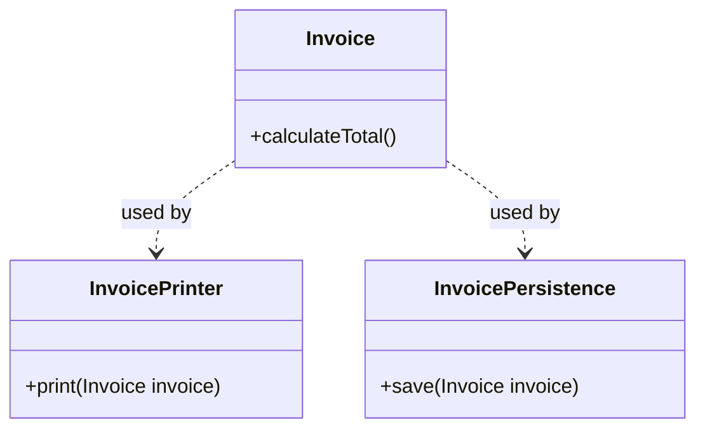
- **Code Snippet (Java)**:
```java
// BAD: Violates SRP
class Invoice {
    void calculateTotal() { ... }
    void printInvoice() { ... } // Mixing logic and presentation
}

// GOOD: Follows SRP
class Invoice {
    void calculateTotal() { ... }
}
class InvoicePrinter {
    void print(Invoice invoice) { ... }
}
```
- **Data Flow**: Data enters through `Invoice`, calculations are performed, and the finished `Invoice` object is passed to `InvoicePrinter`.
- **Follow-up Questions**: "What if the same data needs to be printed in PDF and HTML? How does SRP help?" (Answer: You just add `InvoicePDFPrinter` and `InvoiceHTMLPrinter` without touching the calculation logic).

### 2. SOLID: Open/Closed Principle (OCP)
- **Detailed Explanation**: Software entities (classes, modules, functions) should be open for extension but closed for modification.
- **SOLID Alignment**: The 'O' in SOLID. It prevents you from having to change existing, tested code when adding new features.
- **Interview Answer**: "OCP means 'Add functionality without changing existing code'. I achieve this using Interfaces or Abstract classes. If I have a `Payment` system, I create a `PaymentProcessor` interface. Adding 'ApplePay' just means creating a new class, not editing my existing `ProcessPayment` function."
- **Use Case**:
  1. `Shape` interface with a `draw()` method.
  2. Adding a `Triangle` class without changing the `GraphicEditor` class.
- **Diagram**:
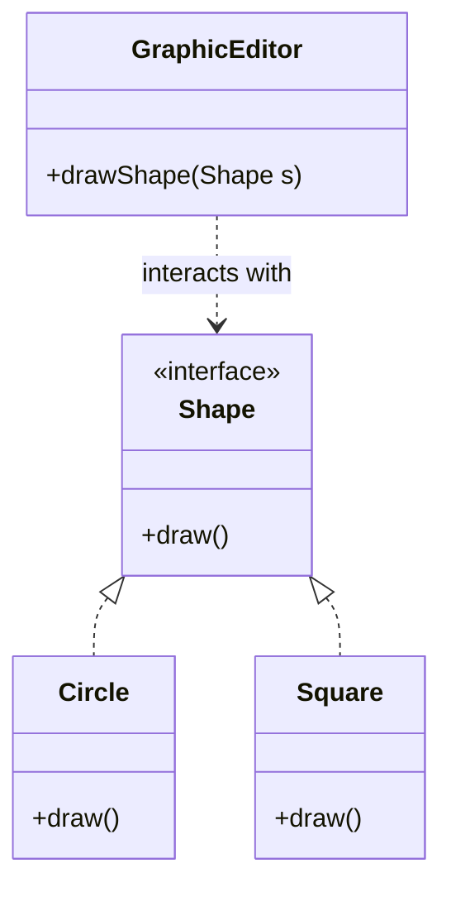
- **Code Snippet (Java)**:
```java
interface Shape { void draw(); }

class Circle implements Shape { public void draw() { System.out.println("Circle"); } }
class Square implements Shape { public void draw() { System.out.println("Square"); } }

// This class is "Closed" for modification
class GraphicEditor {
    public void drawShape(Shape s) { s.draw(); }
}
```
- **Data Flow**: The `GraphicEditor` receives any object that implements `Shape` and calls its `draw()` method.
- **Follow-up Questions**: "How do you handle a new shape that needs a 'fill color' if the interface doesn't have it?" (Answer: Use the Interface Segregation Principle or Default Methods).

### 3. The Strategy Pattern
- **Detailed Explanation**: Defines a family of algorithms, encapsulates each one, and makes them interchangeable. Strategy lets the algorithm vary independently from the clients that use it.
- **SOLID Alignment**: Strongly upholds **Open/Closed Principle** and **Single Responsibility**.
- **Interview Answer**: "The Strategy pattern is like a 'Changeable Brain'. If a `Robot` can 'Walk', 'Run', or 'Fly', I don't use 10 `if-else` statements. I create a `MovementStrategy` interface and swap the 'Fly' strategy into the Robot at runtime."
- **Use Case**:
  1. **Filtering**: Swapping between 'Filter by Date' and 'Filter by Name'.
  2. **Payment**: Choosing between 'Credit Card' or 'PayPal' at checkout.
- **Diagram**:
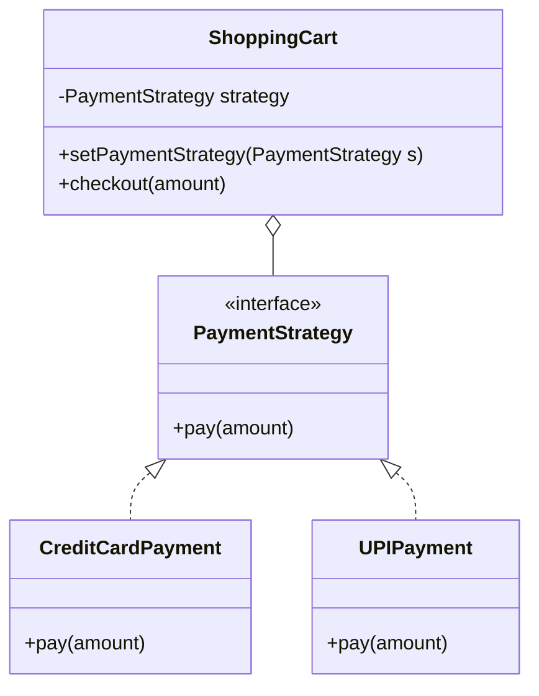
- **Code Snippet (Java)**:
```java
interface PaymentStrategy { void pay(int amount); }

class UPIPayment implements PaymentStrategy {
    public void pay(int amount) { System.out.println("Paid " + amount + " via UPI"); }
}

class ShoppingCart {
    private PaymentStrategy strategy;
    public void setPaymentStrategy(PaymentStrategy s) { this.strategy = s; }
    public void checkout(int amount) { strategy.pay(amount); }
}
```
- **Data Flow**: `ShoppingCart` (Context) maintains a reference to a `PaymentStrategy`. The client sets the specific strategy, and `ShoppingCart` delegates the work.
- **Follow-up Questions**: "When should you NOT use Strategy?" (Answer: When you only have 1 or 2 static algorithms that will never change).

### 4. The Singleton Pattern
- **Detailed Explanation**: Ensures that a class has only one instance and provides a global point of access to it.
- **SOLID Alignment**: Often criticized as it can violate **Single Responsibility** (it manages its own lifecycle) and makes testing harder (violates dependency injection principles).
- **Interview Answer**: "Singleton is the 'One and Only'. I use it for things that *must* be unique, like a `DatabaseConnectionPool` or a `ConfigurationManager`. I implement it using a private constructor and a static `getInstance()` method, ensuring thread-safety with 'Double-Checked Locking'."
- **Use Case**:
  1. `LogManager`: Centralized logging.
  2. `Thread Pool`: Global resource management.
- **Diagram**:
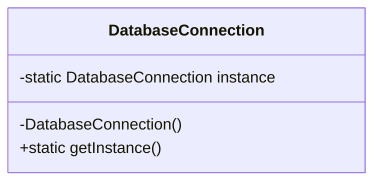
- **Code Snippet (Java)**:
```java
class DatabaseConnection {
    private static volatile DatabaseConnection instance;
    private DatabaseConnection() {} // Private constructor

    public static DatabaseConnection getInstance() {
        if (instance == null) {
            synchronized (DatabaseConnection.class) {
                if (instance == null) instance = new DatabaseConnection();
            }
        }
        return instance;
    }
}
```
- **Data Flow**: Every part of the application calls `getInstance()`, which routes them to the same memory segment.
- **Follow-up Questions**: "What are the pitfalls of Singleton?" (Answer: Hidden dependencies, difficulty in unit testing/mocking, and state leakage across tests).

### 5. Standard LLD: Design a Parking Lot (Basic)
- **Problem Statement**: Design a system to manage parking slots in a single-level parking lot.
- **Detailed Explanation**: This is an entry-level LLD question designed to test your ability to define entities (`Vehicle`, `Slot`, `Level`) and their relationships.
- **SOLID Alignment**:
  - **SRP**: `ParkingLot` handles slots, `ParkingTicket` handles billing.
  - **OCP**: Different vehicle types (Car, Bike, Truck) inherit from a common `Vehicle` class.
- **Interview Answer**: "I start by identifying core entities like `ParkingLot`, `Level`, `ParkingSlot`, and `Vehicle`. I use an Enum for `VehicleType` and `SlotStatus`. The main logic resides in a `ParkingManager` that finds the nearest available slot and marks it occupied."
- **Use Case**: A simple automated gate system for a small office park.
- **Diagram**:
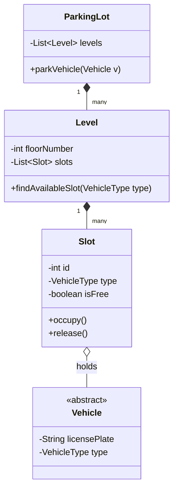
- **Code Structure**:
  - `ParkingLot` (Singleton)
  - `Level` (List of Slots)
  - `ParkingSlot` (id, type, isFree)
  - `Vehicle` (Abstract) -> `Car`, `Motorcycle`
- **Data Flow**: Vehicle arrives -> `EntryGate` asks `ParkingLot` for a slot -> `ParkingLot` iterates through `Levels` -> `ParkingSlot` is assigned -> `Ticket` is generated.
- **Follow-up Questions**: "How do you handle multiple levels? What if the parking lot is full?" (Answer: Add a `Level` class and implement a 'Full' status check in the `ParkingLot`).

### 6. The Factory Method Pattern
- **Detailed Explanation**: Provides an interface for creating objects in a superclass, but allows subclasses to alter the type of objects that will be created.
- **SOLID Alignment**: Supports **Single Responsibility** (moving creation code to one place) and **Open/Closed** (introducing new types doesn't break existing code).
- **Interview Answer**: "The Factory Method is 'The Object Specialist'. Instead of calling `new Door()`, I call `gate.makeDoor()`. This decouples the client from the specific class being created. If I need a 'Magic Door' tomorrow, I just create a `MagicGate` subclass, and the rest of the app never knows the difference."
- **Use Case**:
  1. `ShapeFactory`: Returns generic `Shape` objects.
  2. `LogHandlerFactory`: Returns `ConsoleLogger` or `FileLogger`.
- **Code Snippet (Java)**:
```java
abstract class VehicleFactory {
    public abstract Vehicle createVehicle();
}

class CarFactory extends VehicleFactory {
    public Vehicle createVehicle() { return new Car(); }
}

class BikeFactory extends VehicleFactory {
    public Vehicle createVehicle() { return new Bike(); }
}
```
- **Data Flow**: The client calls the Factory's `create` method. The Factory subclass instantiates the concrete object and returns it as a generic type.
- **Follow-up Questions**: "Difference between Simple Factory and Factory Method?" (Answer: Simple Factory is a single class with a switch case; Factory Method uses inheritance).

---

## 🟡 Tier 2: The Intermediate Level
**Focus:** Decoupling, State Management, and Concurrency.

### 1. SOLID: Advanced Principles (LSP, ISP, DIP)
- **Detailed Explanation**:
  - **Liskov Substitution (LSP)**: Subtypes must be substitutable for their base types. (Don't break the base class behavior in a subclass).
  - **Interface Segregation (ISP)**: Clients shouldn't be forced to depend on methods they don't use. (Split large interfaces into small, specific ones).
  - **Dependency Inversion (DIP)**: Depend on abstractions (interfaces), not concretions (classes).
- **Interview Answer**: "LSP ensures that my code stays stable—if I have a `Bird` class with `fly()`, a `Penguin` subclass shouldn't inherit it. ISP says: 'Keep interfaces small'—don't put `print()` and `scan()` in one interface if some devices only print. DIP is the root of Dependency Injection—always code to the Interface so you can swap implementations easily."
- **Use Case**: Using `@Autowired` in Spring to inject an `EmailService` interface instead of the `GmailService` class.

### 2. The Observer Pattern (Pub/Sub)
- **Detailed Explanation**: Defines a one-to-many dependency between objects so that when one object changes state, all its dependents are notified and updated automatically.
- **SOLID Alignment**: Improves **Single Responsibility** (decoupling the Subject from Observers).
- **Interview Answer**: "Observer is the 'News Broadcast'. The `Subject` is the news station, and the `Observers` are the viewers. When the subject has news, it hits a button, and everyone gets notified. This is the heart of Event-Driven systems like React state or Kafka."
- **Use Case**:
  1. **Stock Market**: Notification when a stock price changes.
  2. **UI Listeners**: Buttons notifying multiple components of a click.
- **Diagram**:
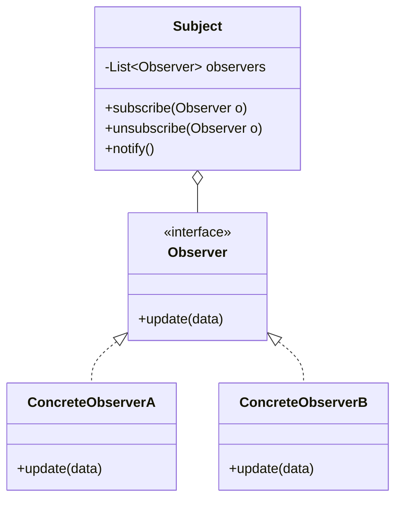
- **Code Snippet (Java)**:
```java
interface Observer { void update(String news); }

class Channel implements Observer {
    public void update(String news) { System.out.println("Breaking News: " + news); }
}

class NewsStation {
    private List<Observer> observers = new ArrayList<>();
    public void subscribe(Observer o) { observers.add(o); }
    public void notify(String news) { for(Observer o : observers) o.update(news); }
}
```
- **Data Flow**: Subject -> List of Observers -> `update()` method on each observer.
- **Follow-up Questions**: "How do you handle memory leaks with Observers?" (Answer: Always provide an `unsubscribe()` method and clean up in the destructor/unload phase).

### 3. The Decorator Pattern
- **Detailed Explanation**: Allows behavior to be added to an individual object, dynamically, without affecting the behavior of other objects from the same class.
- **SOLID Alignment**: Perfect example of the **Open/Closed Principle**.
- **Interview Answer**: "Decorator is the 'Add-on' pattern. It’s like a Pizza—the base is the same, but you 'Wrap' it in a decorator for extra toppings like 'Cheese' or 'Olives'. Unlike inheritance, you can combine decorators at runtime (e.g., Chess Crust + Extra Cheese)."
- **Use Case**:
  1. **Java I/O**: `BufferedInputStream(new FileInputStream())`.
  2. **Auth**: Adding a `LoggingDecorator` around a `LoginService`.
- **Diagram**:
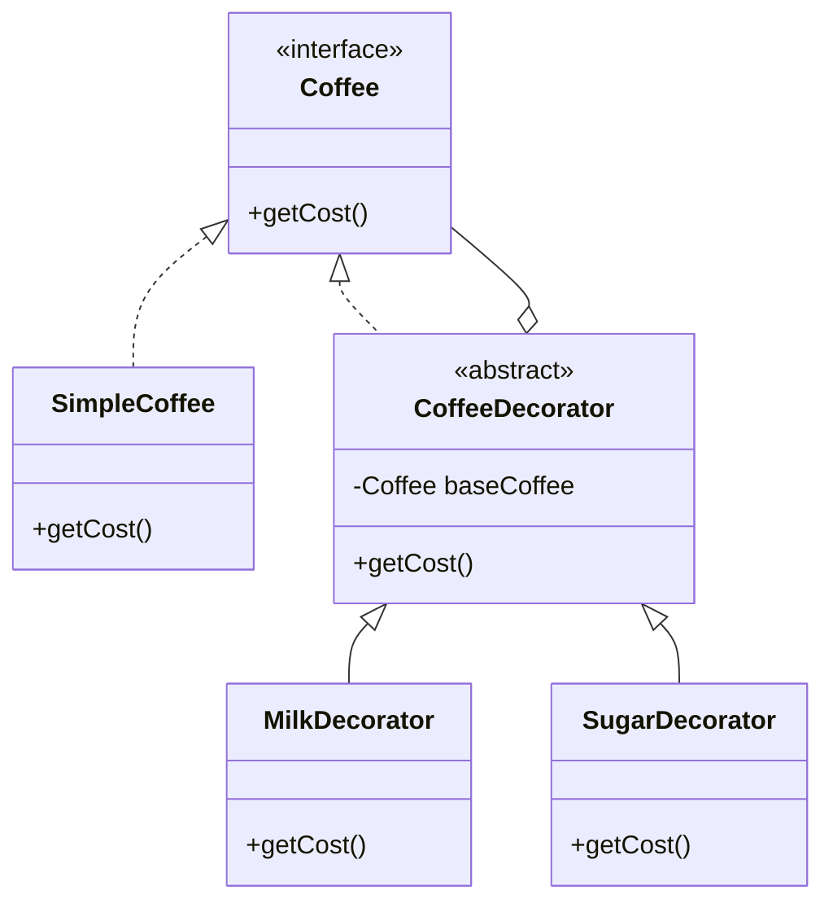
- **Code Snippet (Java)**:
```java
interface Coffee { double getCost(); }

class SimpleCoffee implements Coffee { public double getCost() { return 10; } }

abstract class CoffeeDecorator implements Coffee {
    protected Coffee baseCoffee;
    public CoffeeDecorator(Coffee c) { this.baseCoffee = c; }
}

class MilkDecorator extends CoffeeDecorator {
    public MilkDecorator(Coffee c) { super(c); }
    public double getCost() { return baseCoffee.getCost() + 5; }
}
```
- **Data Flow**: The call 'cascades'—each decorator does its own work and calls the next object in the chain.

### 4. The Adapter Pattern
- **Detailed Explanation**: Allows incompatible interfaces to work together. It acts as a bridge between two independent interfaces.
- **SOLID Alignment**: Upholds the **Open/Closed Principle**.
- **Interview Answer**: "Adapter is the 'Universal Plug'. If my app expects a `Lightning` cable but the user has a `USB-C` cable, I create an `Adapter`. It converts the interface of a class into another interface the clients expect."
- **Use Case**: Using a generic `CloudStorageProvider` but adapting it to work with `AWS S3` or `Google Cloud Storage`.
- **Diagram**:
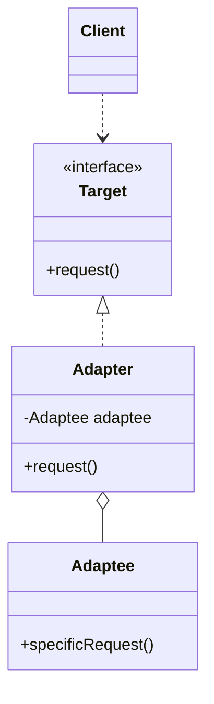

### 5. Concurrency in LLD (Thread-Safety)
- **Detailed Explanation**: In real-world LLD, your objects will be accessed by multiple threads. You must use `synchronized`, `Locks`, or `Volatile` to prevent data corruption.
- **Interview Answer**: "A design isn't 'Production ready' until it’s thread-safe. I use `Double-Checked Locking` for singletons and `ReentrantLocks` or `ConcurrentHashMap` for high-performance data storage. If I'm building a 'Movie Booking' system, I must lock the 'Seat' object during the booking process so two people don't buy the same seat."

### 6. Standard LLD: Design a Vending Machine
- **Problem Statement**: Design a vending machine that accepts coins, provides items, and returns change.
- **Key Pattern**: **State Pattern**.
- **Detailed Explanation**: A Vending Machine changes its behavior based on its current state (`NoCoin`, `HasCoin`, `Dispensing`, `OutOfStock`).
- **Interview Answer**: "I use the **State Pattern** to handle the transitions. Instead of huge `switch` statements, I have a `State` interface with methods like `insertCoin()`, `pressButton()`, and `dispense()`. Each state (e.g., `WaitingState`) handles its own logic and changes the 'current state' of the machine."
- **Diagram**:
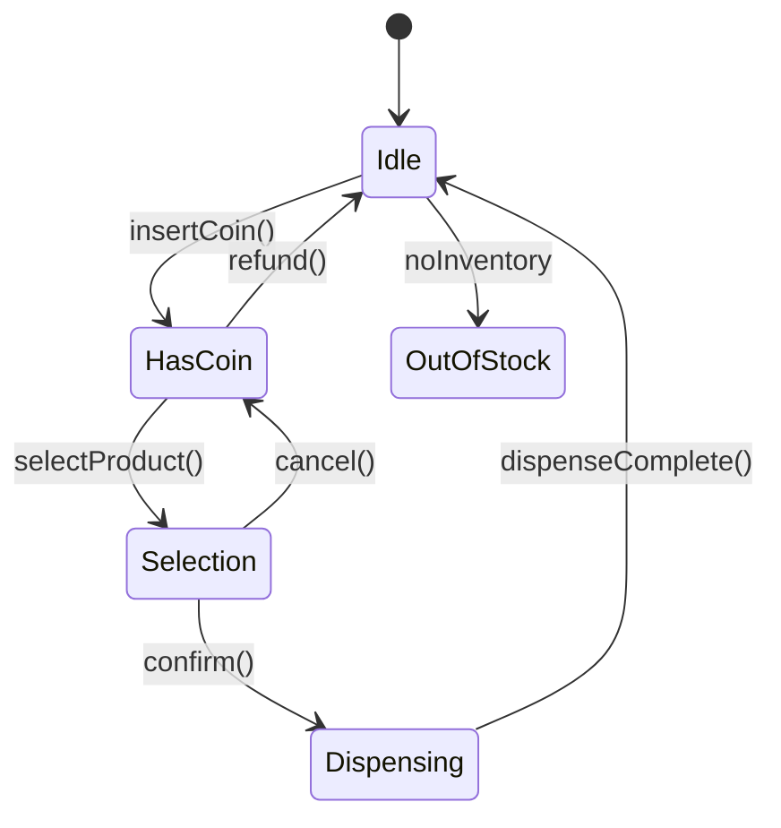
- **Follow-up Questions**: "How do you handle 'Refund'? What if an item fails to dispense?" (Answer: The `RefundingState` handles coin return; item failure triggers a transition back to the `SelectionState`).

---

## 🔴 Tier 3: The Advanced Level
**Focus:** Scalability within a single node, Plugin architectures, and Advanced Patterns.

### 1. The Composite Pattern
- **Detailed Explanation**: Composes objects into tree structures to represent part-whole hierarchies. Composite lets clients treat individual objects and compositions of objects uniformly.
- **SOLID Alignment**: Supports the **Open/Closed Principle** as you can add new component types without changing the code that uses the composition.
- **Interview Answer**: "Composite is the 'Folder-File' pattern. It allows you to treat a single object and a collection of objects the same way. If you are building a 'File System', a `Folder` contains a list of `File` objects. When you call `getSize()`, the folder just iterates and sums up its children's sizes."
- **Use Case**:
  1. **UI Frameworks**: A `Panel` contains `Buttons` and `Textboxes`.
  2. **Org Chart**: A `Manager` has a list of `Employees` (some of whom are also Managers).
- **Diagram**:
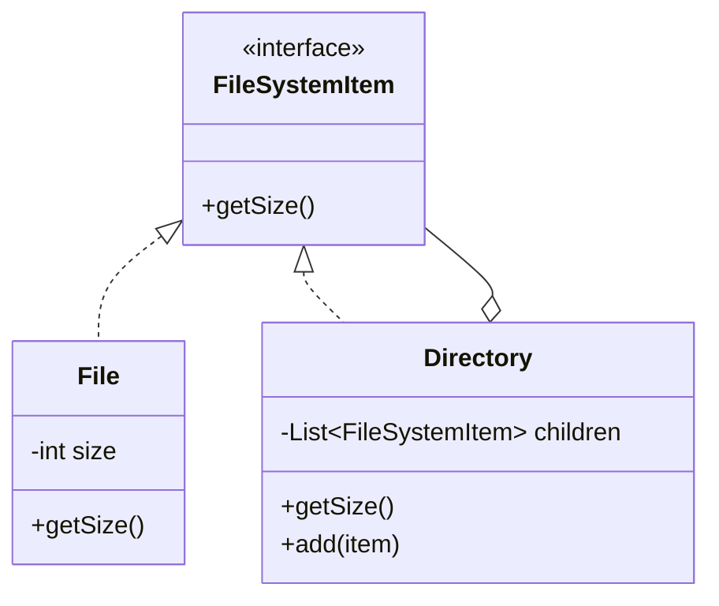
- **Code Snippet (Java)**:
```java
interface FileSystemItem { int getSize(); }

class File implements FileSystemItem {
    private int size;
    public File(int size) { this.size = size; }
    public int getSize() { return size; }
}

class Directory implements FileSystemItem {
    private List<FileSystemItem> children = new ArrayList<>();
    public void add(FileSystemItem item) { children.add(item); }
    public int getSize() {
        return children.stream().mapToInt(FileSystemItem::getSize).sum();
    }
}
```

### 2. The Flyweight Pattern
- **Detailed Explanation**: Used to minimize memory usage or computational expenses by sharing as much as possible with similar objects.
- **SOLID Alignment**: Focuses on performance and resource optimization rather than structure.
- **Interview Answer**: "Flyweight is the 'Memory Saver'. If you are building a game with 1,000,000 trees, you don't store 1,000,000 copies of the leaf texture. You store it once in a 'Flyweight Factory' and give every tree a reference to that one texture. It turns GigaBytes of RAM into MegaBytes."
- **Use Case**:
  1. **Text Editors**: Sharing the same font/style object for every character.
  2. **Gaming**: Sharing 3D models and textures across multiple NPCs.
- **Diagram**:
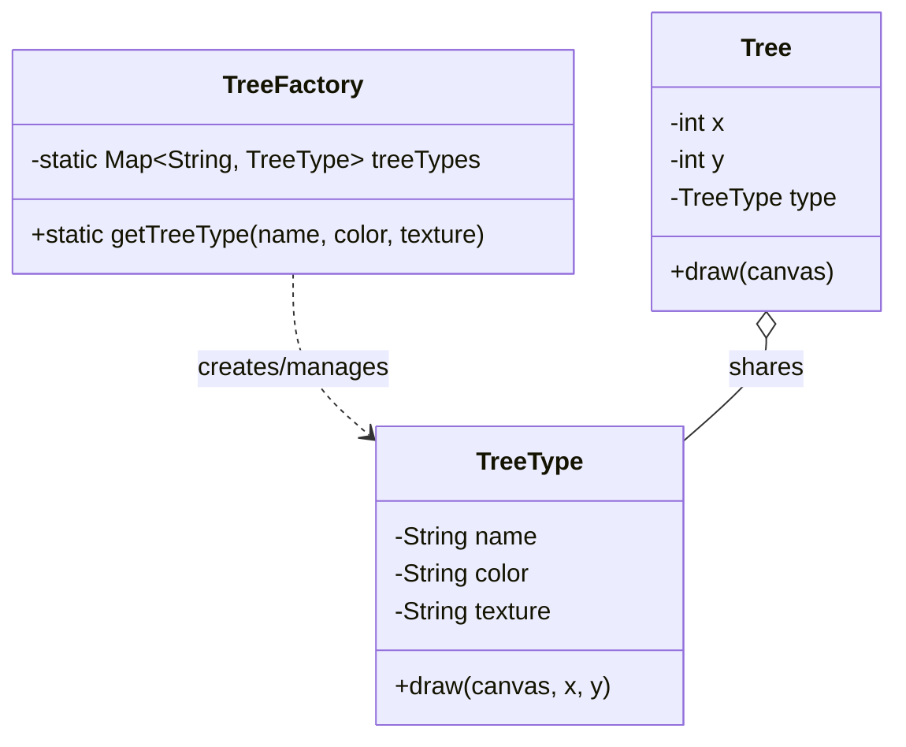

### 3. Chain of Responsibility
- **Detailed Explanation**: Avoids coupling the sender of a request to its receiver by giving more than one object a chance to handle the request.
- **SOLID Alignment**: Excellent for **Single Responsibility** (each handler does one check) and **Open/Closed** (add new checks easily).
- **Interview Answer**: "Chain of Responsibility is the 'Middleware' pattern. When a request hits your server, it goes through a pipeline: `AuthCheck` -> `LoggingCheck` -> `RateLimitCheck`. If one fails, the chain stops. If it passes, it moves to the next handler."
- **Use Case**:
  1. **ATM Dispenser**: Handling $100 bills, then $50, then $20.
  2. **Express.js Middleware**: `app.use(logger)`.
- **Diagram**:
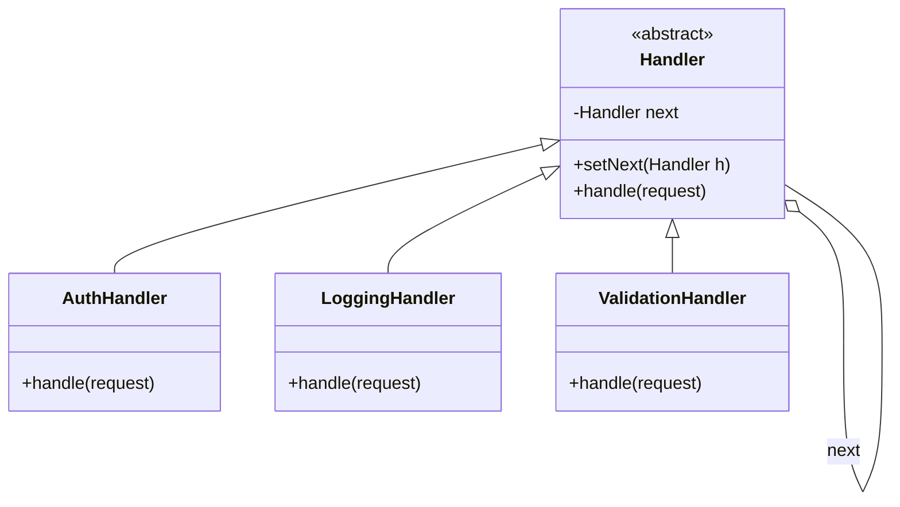

### 4. Algorithmic LLD (Cache & Autocomplete)
- **Problem: LRU Cache**:
  - **Logic**: Combine a `HashMap` (for O(1) lookups) with a `Doubly LinkedList` (to track 'Least Recently Used').
  - **Interview Tip**: "Explain why you need both. HashMap gives speed, but it has no order. LinkedList gives order, but finding an element is O(n)."
- **Problem: Autocomplete (Trie)**:
  - **Logic**: Use a **Trie** (Prefix Tree) where each node represents a character. This allows for extremely fast 'search prefix' operations.
  - **Use Case**: Google Search bar or VS Code intellisense.

### 5. Standard LLD: Design a Chess Game
- **Problem Statement**: Design a game that handles rules, turn-taking, and board state.
- **Key Pattern**: **Command Pattern** (for Undo/Redo) and **Strategy** (for Move Validation).
- **Detailed Explanation**:
  - `Piece` (Abstract) -> `King`, `Queen` (Each has a `MoveStrategy`).
  - `Board`: Manages the 8x8 grid.
  - `Command`: Represents a single move (Allows replaying or undoing the match).
- **Interview Answer**: "I represent the board as a 2D array of `Spot` objects. Each `Spot` has a `Piece`. I use the **Command Pattern** to store moves in a stack, allowing me to implement 'Undo' functionality perfectly. For move validation, each piece has its own internal logic."
- **Diagram**:
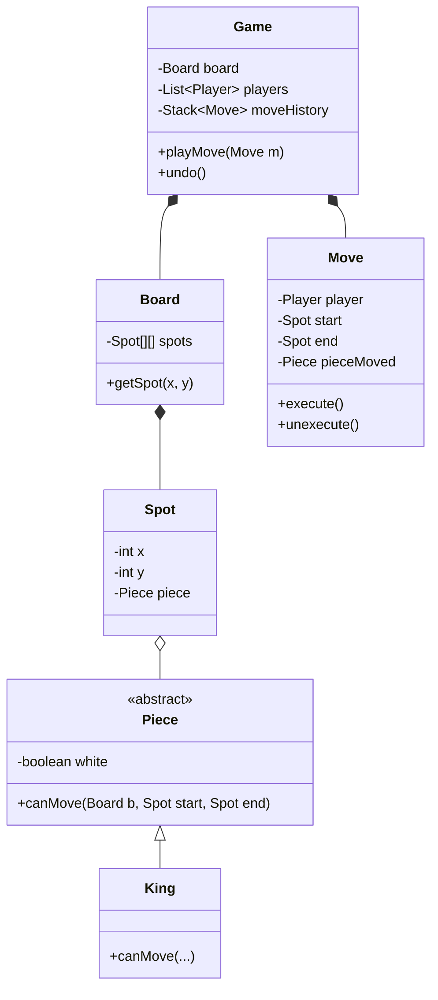

---

## 🛠️ Advanced Topics & Best Practices

### 1. Schema Design
- Even in LLD, think about persistence. Can your classes be easily mapped to a DB? Use `UUID`s as primary keys and think about relationships (One-to-Many vs Many-to-Many).

### 2. Error Handling Strategy
- **Custom Exceptions**: Create a hierarchy (e.g., `ParkingLotException` -> `NoEmptySlotException`).
- **Graceful Failure**: Never return `null`; return an `Optional` or throw a meaningful exception.

### 3. Testing Patterns
- **Mocking**: Use Mockito to mock the 'Payment Gateway' in your Vending Machine LLD to test the success/failure states without real money.
- **Edge Cases**: Always test 'Concurrency' (two threads trying to book the last seat) and 'Negative' scenarios (withdrawing more money than available).

---

**Next Steps:**
- Use this guide to practice writing the code for these problems from scratch on a whiteboard.
- Focus on the **Interface First** approach—define your contracts before your implementations.
