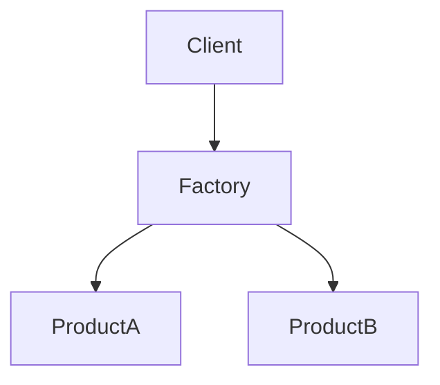
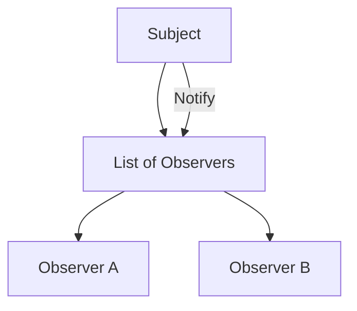

# 🏗️ Low-Level Design (LLD) Mastery Guide (Part 2)

This guide focuses on **code structure, class relationships, and logic patterns**. It transforms architectural requirements into clean, maintainable, and efficient code.

---

## 🟢 Category 1: Object-Oriented Fundamentals (Mastering Objects)

### 1. The Core Pillars (Encapsulation, Abstraction, Inheritance, Polymorphism)
- **What**: 
  - **Encapsulation**: Bundling data and methods into a single unit (Class) and hiding internal state.
  - **Abstraction**: Hiding complex implementation details and showing only essential features.
  - **Inheritance**: A mechanism where one class acquires properties of another.
  - **Polymorphism**: The ability of an object to take on many forms (Overloading vs. Overriding).
- **How**: 
  - **Encapsulation**: Use `private` variables and `public` getters/setters.
  - **Abstraction**: Use `interface` and `abstract class`.
  - **Inheritance**: Use `extends` keyword (Base-Derived relationship).
  - **Polymorphism**: Method signatures (Overloading) or Dynamic Dispatch (Overriding).
- **When**: Always, to ensure code reusability and security.
- **Why**: Foundations for robust, modular code that scales with team size.

### 2. Interfaces vs. Abstract Classes
- **What**: 
  - **Interface**: A 100% abstract contract.
  - **Abstract Class**: A class that can have both implemented and abstract methods.
- **How**: `interface Moveable { void move(); }` vs `abstract class Animal { ... }`.
- **When**: 
  - **Interface**: For peripheral capabilities (e.g., `Serializable`).
  - **Abstract Class**: For core object identity (e.g., `Vehicle`).
- **Why**: Interfaces allow safe multiple-inheritance of behavior; Abstract classes reduce boilerplate through shared code.

### 3. Relationships: Composition vs. Aggregation vs. Association
- **What**: 
  - **Composition**: "Owned" child (Strong dependency).
  - **Aggregation**: "Used" child (Weak dependency).
  - **Association**: General link between objects.
- **How**: 
  - **Composition**: Child created inside the parent.
  - **Aggregation**: Child passed into the parent via constructor but exists outside.
- **When**: Favor **Composition** for lifetime control and **Aggregation** for flexibility.
- **Why**: Crucial for memory management and avoiding tight coupling.

### 4. Method Overloading vs. Overriding (Static vs. Dynamic Binding)
- **What**: 
  - **Overloading**: Same method name, different parameters (Compile-time).
  - **Overriding**: Redefining a base method in a derived class (Runtime).
- **How**: Compiler checks signature (Overloading); Virtual Table (vTable) lookup (Overriding).
- **When**: 
  - **Overloading**: For convenience (e.g., `print(int i)`, `print(String s)`).
  - **Overriding**: To provide specialized behavior in child classes.
- **Why**: Overloading provides readability; Overriding provides runtime flexibility (Polymorphism).

### 5. Access Modifiers & Static vs. Instance Members
- **What**: 
  - **Access Modifiers**: Visibility filters (`public`, `private`, `protected`, `default`).
  - **Static**: Belongs to the class (shared memory).
  - **Instance**: Belongs to the object (unique memory).
- **How**: `static` keyword for shared utility methods or counters.
- **When**: `private` by default for fields; `static` for constants and pure utility.
- **Why**: Modifiers enforce encapsulation; Static members optimize memory for shared data.

### 6. Constructors & Object Lifecycle (Copy, Default, Finalizers)
- **What**: Special methods that initialize objects.
- **How**: 
  - **Default**: Provided by compiler if none exist.
  - **Copy**: Creates a new object by copying an existing one.
- **When**: Use **Copy Constructors** for deep copying complex objects to avoid reference leaks.
- **Why**: Ensures every object starts in a valid, predictable state.

### 7. Nested/Inner Classes & Anonymous Classes
- **What**: Classes defined inside another class.
- **How**: `static inner` (detached) vs `non-static inner` (requires parent instance).
- **When**: For "helper" classes that only make sense within one context (e.g., a custom `Iterator`).
- **Why**: Improves logical grouping and encapsulation of logic used in exactly one place.

### 8. Object Identity vs. Equality (Shallow vs. Deep Copy)
- **What**: 
  - **Identity**: `==` (Memory address check).
  - **Equality**: `.equals()` (Logical value check).
- **How**: Override `equals()` and `hashCode()` together.
- **When**: Essential when using objects in `HashSet` or `HashMap`.
- **Why**: Prevents "phantom" items or duplicate entries in collections.

### 9. Diamond Problem & Multiple Inheritance
- **What**: Ambiguity caused by inheriting from two classes with the same method.
- **How**: Solved in modern languages (Java/C#) by disallowing multiple class inheritance but allowing multiple interfaces.
- **When**: When a class needs to fulfill multiple "Is-A" or "Can-Do" roles.
- **Why**: Prevents runtime complexity and ambiguous method resolution.

### 10. Reflection API & Generics
- **What**: 
  - **Generics**: Type-safe templates (`List<T>`).
  - **Reflection**: Inspecting or modifying code at runtime.
- **How**: Using `<T>` for generics; `Class.forName()` for reflection.
- **When**: 
  - **Generics**: For any collection or reusable data structure.
  - **Reflection**: For frameworks (Spring, Hibernate) or testing tools.
- **Why**: Generics provide compile-time safety; Reflection provides meta-programming power.

---

## 🟡 Category 2: SOLID & GRASP Principles (Design Laws)

### 1. SOLID: Single Responsibility (SRP) & Open-Closed (OCP)
- **What**: 
  - **SRP**: A class should have one, and only one, reason to change.
  - **OCP**: Code should be open for extension but closed for modification.
- **How**: 
  - **SRP**: Move email logic to an `EmailService` instead of keeping it in the `User` class.
  - **OCP**: Use interfaces or abstract classes to add new features via new implementation classes.
- **When**: When a class handles multiple actors (e.g., HR vs. Accounting) or when adding a feature requires changing core logic.
- **Why**: SRP reduces the "Impact Zone" of bugs; OCP prevents regression in stable, tested code.

### 2. SOLID: Liskov Substitution (LSP) & Interface Segregation (ISP)
- **What**: 
  - **LSP**: Derived classes must be perfectly usable as their base classes without breaking the app.
  - **ISP**: Smaller, specialized interfaces are better than one "fat" interface.
- **How**: 
  - **LSP**: Don't throw `NotImplementedException` for methods defined in the parent.
  - **ISP**: Split a `Worker` interface into `Workable` and `Feedable`.
- **When**: When you find yourself creating "Dummy" method implementations to satisfy an interface.
- **Why**: LSP ensures logical hierarchy safely; ISP reduces the coupling of clients to irrelevant methods.

### 3. SOLID: Dependency Inversion (DIP)
- **What**: High-level modules should not depend on low-level modules; both should depend on abstractions.
- **How**: Inject an interface (`IDatabase`) into the constructor of a service, rather than instantiating `MySQLDatabase` inside.
- **When**: In every architectural layer to enable unit testing with mocks.
- **Why**: Decouples business logic from infrastructure (DB, API, Disk).

### 4. GRASP: Information Expert & Creator
- **What**: 
  - **Information Expert**: Assign responsibility to the class that owns the data.
  - **Creator**: Assign Class B to create Class A if B uses A closely or has the data for A.
- **How**: If `Order` has `Lines`, `Order` should be the one calculating the total price.
- **When**: During the domain modeling phase to determine "Who does what?".
- **Why**: Ensures high cohesion and logical placement of business logic.

### 5. GRASP: Low Coupling & High Cohesion
- **What**: 
  - **Low Coupling**: Minimizing dependencies between classes.
  - **High Cohesion**: Keeping related logic together in one place.
- **How**: Use interfaces for communication (Coupling); Keep methods focused on one task (Cohesion).
- **When**: Every architectural decision should weigh these two trade-offs.
- **Why**: High coupling makes changes hard; Low cohesion makes code confusing and scattered.

### 6. GRASP: Pure Fabrication & Indirection
- **What**: 
  - **Pure Fabrication**: Creating a class that doesn't exist in the domain (e.g., `PersistenceService`) to maintain cohesion.
  - **Indirection**: Adding an intermediary object to decouple two components.
- **How**: Creating a `Logger` class instead of making every class handle its own file I/O.
- **When**: When follow-the-domain rules would violate SRP or lead to high coupling.
- **Why**: Keeps domain objects clean and focused only on logic, not infrastructure.

### 7. Protected Variations (GRASP)
- **What**: Identifying points of likely change or instability and wrapping them in an interface.
- **How**: Using a wrapper around a 3rd-party library (e.g., `PaymentGateway` wrapper for Stripe).
- **When**: When depending on external systems or unstable internal modules.
- **Why**: Protects the rest of the system from changes in the unstable part.

### 8. Law of Demeter (Principle of Least Knowledge)
- **What**: A module should only talk to its immediate dependencies, not "friends of friends".
- **How**: Avoid "Train Wrecks" like `user.getAccount().getStats().getTier()`.
- **When**: When you find you are reaching deep into another object's internal structure.
- **Why**: Reduces coupling and prevents code breakage when intermediate objects change.

### 9. Tell, Don't Ask & Separation of Concerns (SoC)
- **What**: 
  - **Tell, Don't Ask**: Tell an object what to do, don't ask it for its state and then do it yourself.
  - **SoC**: Partitioning a program into distinct sections, each addressing a separate concern.
- **How**: Use `account.withdraw(50)` instead of `if(acc.getBal() > 50) acc.setBal(...)`.
- **When**: To move logic closer to data and separate UI, Logic, and Data layers.
- **Why**: Prevents "Anemic Domain Models" and ensures that changes to logic happen in one canonical place.

### 10. DRY, KISS, & YAGNI
- **What**: 
  - **DRY**: Don't Repeat Yourself.
  - **KISS**: Keep It Simple, Stupid.
  - **YAGNI**: You Ain't Gonna Need It.
- **How**: Use utility methods (DRY); Avoid over-engineering (YAGNI/KISS).
- **When**: During code reviews and initial implementation.
- **Why**: Reduces maintenance costs and prevents unnecessary complexity.

---

## 🏗️ Category 3: Creational Design Patterns (Building Objects)

### 1. Singleton Pattern (Eager vs. Lazy)
- **What**: Ensures a class has only one instance and provides a global point of access.
- **How**: 
  - **Eager**: Instance created at class loading.
  - **Lazy (Thread-safe)**: Instance created on first use, using **Double-checked locking**.
- **When**: For shared resources like Database Connections, Logging, or Configuration managers.
- **Why**: Saves memory by avoiding multiple instances of heavy objects and ensures consistency.

### 2. Factory Method vs. Abstract Factory
- **What**: 
  - **Factory Method**: A method that returns an instance of a class based on input (e.g., `ShapeFactory.getShape("Circle")`).
  - **Abstract Factory**: A "Factory of Factories" that creates families of related objects (e.g., `WindowsFactory` creating `WindowsButton` and `WindowsCheckbox`).
- **How**: Using inheritance (Factory Method) or composition/interfaces (Abstract Factory).
- **When**: 
  - **Factory Method**: When you don't know the exact class you need until runtime.
  - **Abstract Factory**: When your system needs to be independent of how its products are created or composed.
- **Why**: Decouples the client from the concrete classes, making it easy to add new types without changing client code.
- **Diagram (Factory Method)**:


### 1. Singleton: Thread-Safe & Enum Implementations
- **What**: Ensuring a class has exactly one instance.
- **How**: 
  - **Thread-safe**: Use the `volatile` keyword and double-checked locking inside a `synchronized` block.
  - **Enum Singleton**: Industry-standard (Java) way to prevent reflection-based instantiation and provide serialization safety.
- **When**: For logging, hardware access, or globally shared configuration.
- **Why**: Protects state consistency and prevents memory bloat for heavy, shared objects.

### 2. Simple Factory vs. Factory Method vs. Abstract Factory
- **What**: 
  - **Simple Factory**: A static method creating objects based on input (Not a GOF pattern).
  - **Factory Method**: Subclasses decide which class to instantiate (Interface-based).
  - **Abstract Factory**: Creates families of related objects (Platform-based).
- **How**: `ShapeFactory.create("Line")` (Simple) vs `Document.createPage()` (Method) vs `MacUIFactory.createButton()` (Abstract).
- **When**: Use **Simple Factory** for low complexity; **Abstract Factory** when the system must be independent of its product creation.
- **Why**: Decouples the client from concrete classes, allowing new types to be added via "Plugin" architecture.

### 3. Builder Pattern (Step-by-Step) & Fluent Interface
- **What**: 
  - **Builder**: Constructing complex objects using a step-by-step approach.
  - **Fluent Interface**: Chaining methods for readability.
- **How**: A static inner class that accumulates values and returns `this` from every setter.
- **When**: When attributes are many, optional, or must follow a specific sequence.
- **Why**: Eliminates "Telescoping Constructors" and makes the code read like a domain language.

### 4. Prototype & Monostate Patterns
- **What**: 
  - **Prototype**: Creating new instances by copying an existing instance (Cloning).
  - **Monostate**: Instances are unique, but they all SHARE the same static data (Behavioral equivalence).
- **How**: Use `clone()` or a copy constructor (Prototype). Use `static` fields for all class state (Monostate).
- **When**: 
  - **Prototype**: Creation is costly (e.g., loading data from DB).
  - **Monostate**: When you want shared state without force-feeding a "Singleton" access point.
- **Why**: Prototype improves speed; Monostate offers a different trade-off for global state.

### 5. Multiton & Registry Patterns
- **What**: 
  - **Multiton**: A map/registry of named singletons (e.g., 1 per database name).
  - **Registry**: A central place to look up service instances.
- **How**: A `Map<Key, Instance>` in a static field; controlled instantiation via `getInstance(id)`.
- **When**: When you need a "Singleton-per-Context" rather than one globally.
- **Why**: Avoids creating duplicate heavy resources while allowing variation (e.g., different Loggers for different modules).

### 6. Object Pool & Resource Acquisition (RAII)
- **What**: 
  - **Object Pool**: Managing a set of pre-initialized objects ready for use.
  - **RAII**: Resource management where the lifecycle of a resource is tied to the object's lifetime.
- **How**: Using a queue of workers (Pool); Using try-with-resources or destructors (RAII).
- **When**: High-frequency creation of expensive objects (DB Connections, Threads).
- **Why**: Drastically reduces latency and prevents resource leaks.

### 7. Dependency Injection (DI) & IoC Containers
- **What**: 
  - **DI**: Passing dependencies from outside (Constructor vs. Setter).
  - **IoC Container**: Automatic management of object creation and wiring (e.g., Spring/Guice).
- **How**: `@Inject` or `@Autowired` annotations.
- **When**: In almost all modern scalable applications.
- **Why**: Enables unit testing (swapping real DB for mock) and loose coupling.

### 8. Static Factory Methods vs. Service Locator
- **What**: 
  - **Static Factory**: Named creation methods (e.g., `Color.fromHex("#FFF")`).
  - **Service Locator**: A registry used to find service implementations at runtime (Often an anti-pattern).
- **How**: Static method inside the class (Factory). Global lookup service (Locator).
- **When**: Static Factories for better naming; Service Locator only in legacy or plugin systems.
- **Why**: Static factories are readable; Service locators can hide dependencies making code hard to trace.

### 9. Lazy Loading & Virtual Proxy
- **What**: Delaying object creation until the first time it is actually needed.
- **How**: Check for `null` in the getter, and initialize only when accessed.
- **When**: When loading high-memory fields (e.g., large images or complex datasets).
- **Why**: Improves startup performance and memory footprint.

---

## 🏗️ Category 4: Structural Design Patterns (Organizing Classes)

### 1. Adapter (Class vs. Object Adapter)
- **What**: Converting one interface to another. 
- **How**: 
  - **Class Adapter**: Uses inheritance (Derived from both).
  - **Object Adapter**: Uses composition (Wraps the adaptee).
- **When**: When integrating a 3rd party library whose method names don't match your internal interface.
- **Why**: Allows incompatible classes to work together without changing their source code.
- **Diagram (Object Adapter)**:
```mermaid
graph LR
    Client --> Target[<<Interface>> Target]
    Target <|-- Adapter
    Adapter --> Adaptee
```

### 2. Bridge Pattern: Decoupling Abstraction
- **What**: Splitting a large class into two hierarchies: Abstraction and Implementation.
- **How**: The abstraction holds a reference to an implementation interface.
- **When**: When you want to avoid a "Class Explosion" (e.g., `RedCircle`, `BlueCircle`, `RedSquare`, `BlueSquare`).
- **Why**: Allows you to change the UI look and the underlying logic independently.

### 3. Composite Pattern: Tree Hierarchies
- **What**: Treating individual objects and compositions of objects uniformly.
- **How**: Creating a common interface for both `Leaf` and `Composite` classes.
- **When**: For file system folders, UI component trees, or XML/JSON structures.
- **Why**: Simplifies client code as it doesn't need to check if it's dealing with a single object or a collection.

### 4. Decorator Pattern: Dynamic Behavior
- **What**: Adding functionality to an object without altering its structure.
- **How**: A wrapper class that implements the same interface and adds its own logic.
- **When**: Adding "Compression" or "Encryption" to a `FileStream` at runtime.
- **Why**: A flexible alternative to subclassing for extending functionality.

### 5. Facade Pattern: Unified Entry Point
- **What**: Providing a simplified interface to a complex set of classes in a subsystem.
- **How**: A single class that masks the complexity of the subsystem (e.g., a `Computer` facade with a `start()` method).
- **When**: When you want to provide a specific, easy-to-use entry point for a library.
- **Why**: Reduces coupling between the client and the subsystem.

### 6. Flyweight Pattern: Memory Optimization
- **What**: Sharing common parts of state between multiple objects to reduce memory usage.
- **How**: Store **Intrinsic** state (shareable) in a factory and **Extrinsic** state (unique) in the client.
- **When**: Rendering 10k bullets in a game or 1 million characters in a text editor.
- **Why**: Prevents Out-Of-Memory errors by reusing object instances.

### 7. Proxy Pattern (Remote, Virtual, Protection)
- **What**: A placeholder for another object to control access.
- **How**: 
  - **Virtual Proxy**: For lazy loading (e.g., loading a large image only when visible).
  - **Remote Proxy**: Accessing an object in a different memory space (RPC).
  - **Protection Proxy**: Checking access rights before calling the real object.
- **When**: When you need a "Safe Gatekeeper" or "Delay" mechanism.
- **Why**: Adds a level of control/indirection without changing the real object's logic.

### 8. Module & Mixer Patterns (Mixins)
- **What**: 
  - **Module**: Grouping related methods and state (Common in JS/TypeScript).
  - **Mixin**: Injecting code into a class without traditional inheritance.
- **How**: Using static classes or specialized language features (like `traits`).
- **When**: To share utility behavior across unrelated classes (e.g., `Loggable`).
- **Why**: Increases code reuse while avoiding the "Diamond Problem" of multiple inheritance.

### 9. Delegation Pattern & Marker Interface
- **What**: 
  - **Delegation**: One object hands off a task to a helper.
  - **Marker**: An empty interface used to tag a class with metadata (e.g., `Serializable`).
- **How**: `parent.doTask() { helper.doTask(); }`.
- **When**: When you want to favor composition or provide "Tags" for runtime reflection.
- **Why**: Delegation is safer than inheritance; Markers allow for clean "Capability" checks.

### 10. The "Data Pattern" Cluster: Repository, Unit of Work, & Data Mapper
- **What**: 
  - **Repository**: Mediates between domain and data mapping layers (Collection-like interface).
  - **Unit of Work**: Tracks all changes in a "transaction" and flushes them together.
  - **Data Mapper**: Moves data between objects and a database while keeping them independent.
- **How**: Using an interface `IRepository<T>` and a `Commit()` method in the Unit of Work.
- **When**: In almost any enterprise app with a database.
- **Why**: Decouples the database schema from the business logic.

### 11. Value Object & Identity Map
- **What**: 
  - **Value Object**: Immutable object identified by its data, not ID (e.g., `Money`).
  - **Identity Map**: Ensures each object is loaded only once from the DB in a single session.
- **How**: Override `equals()` (Value Object). Use a `Map<ID, Object>` (Identity Map).
- **When**: For complex numbers, dates, or database session management.
- **Why**: Value Objects simplify logic; Identity Maps prevent data inconsistencies and redundant DB hits.

---

## 🏗️ Category 5: Behavioral Design Patterns (Object Interaction)

### 1. Strategy vs. State Pattern (Detailed)
- **What**: 
  - **Strategy**: Selecting an algorithm at runtime.
  - **State**: Changing class behavior based on its internal state.
- **How**: 
  - **Strategy**: Pass strategy to client (`setPaymentMethod`).
  - **State**: Context object delegates to the current State object which may trigger transitions.
- **When**: 
  - **Strategy**: Multiple ways to sort, compress, or encrypt.
  - **State**: Vending machine, Order processing, or Game AI.
- **Why**: Eliminates complex conditionals and encapsulates variation.

### 2. Observer Pattern: One-to-Many
- **What**: Notifying multiple objects when a state change occurs.
- **How**: Subject maintains a list of `Observers`; calls `notifyObservers()` when changed.
- **When**: UI event listeners, Stock price alerts, or Chat notifications.
- **Why**: Decouples the broadcaster from the listeners.
- **Diagram**:


### 3. Command & Memento: Undo/Redo DNA
- **What**: 
  - **Command**: Encapsulating a request as an object.
  - **Memento**: Capturing an object's state to restore it later.
- **How**: Define `execute()` and `undo()` in Command. Use `Originator` and `Caretaker` in Memento.
- **When**: Text editors, Photoshop-style history, or Transaction management.
- **Why**: Decouples requester from performer and provides "Time Travel" capability.

### 4. Chain of Responsibility Pattern
- **What**: A series of handler objects; each can process the request or pass it to the next.
- **How**: Each handler has a reference to the `next` handler in the chain.
- **When**: Logger levels (Info -> Warn -> Error), Middleware (Express, .NET), or ATM cash dispensing.
- **Why**: Reduces coupling between the sender and receiver of a request.

### 5. Iterator & Mediator Patterns
- **What**: 
  - **Iterator**: Sequential access to a collection without revealing its structure.
  - **Mediator**: Centralized communication to avoid "Many-to-Many" chaos.
- **How**: `hasNext()`/`next()` (Iterator). Central `Registry` or `CommunicationHub` (Mediator).
- **When**: Collections (List/Set) or complex UI panels with many interdependent buttons.
- **Why**: Iterator abstracts data structure; Mediator prevents the "God Object" and circular dependencies.

### 6. Template Method vs. Visitor Pattern
- **What**: 
  - **Template**: Defining the skeleton of an algorithm; subclasses fill the steps.
  - **Visitor**: Adding operations to a structure without changing it (Double Dispatch).
- **How**: Abstract base with `final` algorithm method (Template). Elements `accept(visitor)` (Visitor).
- **When**: Data mining pipelines (Template). Compiler parsing trees (Visitor).
- **Why**: Template enforces a process; Visitor allows adding logic to existing hierarchies.

### 7. Null Object & Specification Patterns
- **What**: 
  - **Null Object**: A class that does nothing (neutral behavior) instead of returning `null`.
  - **Specification**: Encapsulating business rules into reusable "Criteria" objects.
- **How**: An implementation of `Logger` that doesn't print anything. A `isPremiumMember` spec object.
- **When**: To avoid `if (obj != null)` checks and to centralize complex query logic.
- **Why**: Makes code cleaner and business rules highly composable.

### 8. Interpreter & Interceptor Patterns
- **What**: 
  - **Interpreter**: Evaluating a language or expression grammar.
  - **Interceptor**: Automatically triggering code before or after an event (AOP).
- **How**: Using a grammar tree (Interpreter). Using a proxy or global hook (Interceptor).
- **When**: SQL parsing, Rule Engines, or standard Logging/Auth middleware.
- **Why**: Interpreter solves complex parsing; Interceptor centralizes "cross-cutting" concerns.

### 9. Callback & Promise/Future Patterns
- **What**: 
  - **Callback**: Handing a function to another to be called later.
  - **Promise/Future**: An object representing the "eventual result" of an async operation.
- **How**: Function pointers or Lambda expressions.
- **When**: Non-blocking IO, Network requests, or intensive background tasks.
- **Why**: Allows processing to continue while waiting for a slow task to complete.

### 10. Business Delegate & Service Layer
- **What**: Decoupling the presentation tier from the business logic tier.
- **How**: Interface service that hides the complexity of lookup and service instantiation.
- **When**: Multi-tier architecture (Web apps).
- **Why**: Simplifies client code and hides implementation details of remote services.

---

## 🔵 Category 6: UML & Modeling Concepts (Visualizing Design)

### 1. Structural UML: Class, Object, & Component Diagrams
- **What**: 
  - **Class**: Static blueprint of the system.
  - **Object**: Snapshot of instances at runtime.
  - **Component**: Physical modularity (DLLs, JARs, microservices).
- **How**: Using boxes, attributes, and relationship arrows.
- **When**: 
  - **Class**: Initial design and documentation.
  - **Object**: Explaining complex object graphs.
  - **Component**: Planning third-party integrations and physical structure.
- **Why**: Visualizes ownership and modularity before code is built.

### 2. Behavioral UML: Sequence & Collaboration Diagrams
- **What**: 
  - **Sequence**: Time-ordered interaction between objects.
  - **Collaboration (Communication)**: Focuses on object organization rather than time.
- **How**: Lifelines and message arrows (Sequence); Numbers on arrows (Collaboration).
- **When**: Mapping out a "Checkout" flow or "Login" logic across services.
- **Why**: Identifies bottlenecks and logic gaps in multi-object coordination.

### 3. Lifecycle UML: State & Activity Diagrams
- **What**: 
  - **State**: Transitions of a single object (e.g., File: `Open` -> `Locked`).
  - **Activity**: Flowchart of a business process (e.g., `If` conditions, `Parallel` tasks).
- **How**: States in rounded boxes; Arrows for events (State). Swimlanes for roles (Activity).
- **When**: For complex logic with many status updates (e.g., Order fulfillment).
- **Why**: Prevents "Impossible States" and clarifies business workflows.

### 4. Use Case & Deployment Diagrams
- **What**: 
  - **Use Case**: Boundary of the system and user goals (Actors).
  - **Deployment**: Mapping software components to hardware (Nodes).
- **How**: Stick figures and ovals (Use Case). 3D cubes for nodes (Deployment).
- **When**: Gathering requirements (Use Case). Planning production infrastructure (Deployment).
- **Why**: High-level alignment between stakeholders and engineering.

### 5. UML Notations: Multiplicity, Visibility, & Stereotypes
- **What**: 
  - **Multiplicity**: Numbers (`1`, `*`, `0..1`).
  - **Visibility**: Access modifiers (`+`, `-`, `#`, `~`).
  - **Stereotypes**: Metadata tags (`<<interface>>`, `<<abstract>>`).
- **How**: Placed next to associations or inside class headers.
- **When**: In every detailed class diagram.
- **Why**: Provides the precision needed to generate code directly from diagrams.

### 6. Domain-Driven Design (DDD): Entities vs. Value Objects
- **What**: 
  - **Entities**: Objects with a unique ID that persists over time (e.g., `User`).
  - **Value Objects**: Immutable objects identified by attributes (e.g., `Color`, `Currency`).
- **How**: Identity equality (Entity) vs. Attribute equality (Value Object).
- **When**: Building the "Core Domain" of a complex business application.
- **Why**: Simplifies code—Value Objects can be shared safely and compared easily.

### 7. DDD: Aggregates, Roots, & Bounded Contexts
- **What**: 
  - **Aggregate**: A cluster of associated objects treated as a unit.
  - **Aggregate Root**: The single entry-point to the cluster (e.g., `Order` is root for `LineItems`).
  - **Bounded Context**: Explicit boundary where a model is valid.
- **How**: Enforce that external objects only hold references to the Root.
- **When**: Managing large, complex data relationships.
- **Why**: Ensures data consistency and prevents "spaghetti" references across the system.

### 8. Ubiquitous Language & Domain Services
- **What**: 
  - **Ubiquitous Language**: Using the same terms in code and business discussions.
  - **Domain Service**: Logic that doesn't fit into a specific Entity (e.g., `MoneyTransferService`).
- **How**: Shared glossary of terms (Language). Pure Fabrication classes (Service).
- **When**: Throughout the entire SDLC.
- **Why**: Minimizes translation errors between business stakeholders and developers.

### 9. CRC Cards & Robustness Analysis
- **What**: 
  - **CRC Cards**: Class-Responsibility-Collaboration (Low-tech brainstorming).
  - **Robustness**: Bridging Use Cases and Design (Boundary, Control, Entity objects).
- **How**: Physical index cards (CRC). Circles with lines (Robustness).
- **When**: Early rapid design brainstorming.
- **Why**: Quickly flushes out missing classes and responsibilities without the overhead of full UML.

### 10. Unified Process (UP) & RUP Basics
- **What**: An iterative software development framework.
- **How**: Phases: Inception, Elaboration, Construction, Transition.
- **When**: For large-scale, high-ceremony projects.
- **Why**: Focuses on architecture early to reduce risk.

---

## 🔴 Category 7: Concurrency & Threading (Multi-threaded Design)

### 1. Synchronization: Mutex vs. Semaphore vs. Barriers
- **What**: 
  - **Mutex**: Only one thread can enter the room (Lock).
  - **Semaphore**: Room fits N people (Pool).
  - **Barrier**: Everyone must reach a point before anyone can continue (Sync point).
- **How**: `mutex.lock()`, `semaphore.acquire(2)`, `cyclicBarrier.await()`.
- **When**: 
  - **Mutex**: Writing to a shared log file.
  - **Semaphore**: Limiting concurrent API calls.
  - **Barrier**: Map-Reduce style parallel processing.
- **Why**: Prevents race conditions and ensures threads work in a coordinated fashion.

### 2. Thread Safety: Race Conditions, Data Races, & Immutability
- **What**: 
  - **Race Condition**: Result depends on the order of execution.
  - **Data Race**: Two threads access memory at the same time and one is a write.
  - **Immutability**: Once an object is created, it cannot change.
- **How**: Use `synchronized`, `final` variables, or thread-safe collections (`ConcurrentHashMap`).
- **When**: Whenever data is shared across multiple threads.
- **Why**: Immutability is the easiest way to achieve thread safety—no changes means no races.

### 3. Advanced Locking: Read-Write Locks & Optimistic Locking
- **What**: 
  - **Read-Write Lock**: Multiple readers allowed OR one writer (but not both).
  - **Optimistic Locking**: Assume no conflict; check version on update.
- **How**: `ReentrantReadWriteLock` (Java). Using a `version` column in a DB record.
- **When**: 
  - **Read-Write**: High read/low write scenarios (e.g., Cache lookup).
  - **Optimistic**: Distributed systems or DBs where conflicts are rare.
- **Why**: Increases performance by avoiding heavy locks where they aren't strictly necessary.

### 4. Concurrency Patterns: Monitor Object & Active Object
- **What**: 
  - **Monitor**: Encapsulates data and synchronization into one object (Implicit locks).
  - **Active**: Decouples method execution from method invocation (Async execution).
- **How**: Mark methods as `synchronized` (Monitor). Use a message queue for method calls (Active).
- **When**: Java `synchronized` methods (Monitor). High-scale async actors (Active).
- **Why**: Monitor simplifies development; Active object improves responsiveness by offloading work.

### 5. Architectural Patterns: Half-Sync/Half-Async & Leader/Followers
- **What**: 
  - **Half/Half**: One layer handles events (Async), another handles processing (Sync).
  - **Leader/Followers**: One thread waits for an event (Leader); once received, it hands leadership to a follower and starts processing.
- **How**: Using thread pools and event loops.
- **When**: Web servers handling thousands of connections (e.g., Nginx style).
- **Why**: Efficiently scales to high concurrency without thread-per-connection overhead.

### 6. Thread-Safe Tools: Volatile, Atomic, & Thread-Local
- **What**: 
  - **Volatile**: Guarantees visibility (Memory Barrier).
  - **Atomic**: Guarantees atomicity (CAS - Compare And Swap).
  - **Thread-Local**: Variables local to a specific thread (No sharing).
- **How**: `volatile boolean stop = true;`, `AtomicLong counter = new AtomicLong();`.
- **When**: 
  - **Volatile**: For flags checked by multiple threads.
  - **Atomic**: For counters in high-contention systems.
- **Why**: Volatile is cheaper than a lock; Atomic enables lock-free algorithms.

### 7. Classic Problems: Dining Philosophers & Producer-Consumer
- **What**: 
  - **Philosophers**: 5 people, 5 forks, need 2 to eat (Deadlock risk).
  - **Producer-Consumer**: Syncing a data generator with a data worker.
- **How**: Use a `BlockingQueue` (PC). Assign a global order to resources (Philosophers).
- **When**: Every developer must understand these to recognize patterns of failure.
- **Why**: These abstractions help solve complex deadlocks and buffer imbalances in real code.

### 8. Liveness Failures: Deadlocks, Livelocks, & Starvation
- **What**: 
  - **Deadlock**: A->B, B->A (Circle of waiting).
  - **Livelock**: A steps left, B steps right, they keep dancing (No progress).
  - **Starvation**: High-priority threads keep a low-priority thread from ever running.
- **How**: Avoid circular waits; Use timeouts on locks (`tryLock`).
- **When**: Designing any system with multiple locks.
- **Why**: Ensuring "Liveness" is as important as "Correctness" in multi-threaded code.

### 9. Management: Thread Pools, Executors, & Fork-Join
- **What**: 
  - **Thread Pool**: Managing a reuseable set of threads.
  - **Fork-Join**: Dividing a task into smaller sub-tasks recursively.
- **How**: `Executors.newFixedThreadPool(n)`. `RecursiveTask` (Fork-Join).
- **When**: High CPU-bound parallel work (Fork-Join); Standard background tasks (ThreadPool).
- **Why**: Prevents OS resource exhaustion and optimizes CPU utilization.

### 10. Modern Concurrency: Event Loops & Reactive Programming
- **What**: 
  - **Event Loop**: A single thread processing events from a queue (e.g., Node.js).
  - **Reactive**: Data flows as streams that can be observed and transformed.
- **How**: Using `setTimeout`/`process.nextTick` or libraries like `RxJava`/`Project Reactor`.
- **When**: High-IO, low-latency applications (e.g., gateways, interactive frontends).
- **Why**: Reactive handles massive concurrency with a small footprint; Event Loop simplifies thread safety.

---

## 🟣 Category 8: Testing, Clean Code & Refactoring (Quality)

### 1. The Testing Pyramid: Unit, Integration, & System Tests
- **What**: 
  - **Unit**: Testing a single function/class in isolation.
  - **Integration**: Testing the interaction between two or more modules.
  - **System**: Testing the end-to-end user flow.
- **How**: Mocking external dependencies (Unit). Using a test DB or container (Integration).
- **When**: 
  - **Unit**: During development (Fast feedback).
  - **Integration**: CI/CD pipeline (Ensure components talk correctly).
- **Why**: Higher up the pyramid, tests get slower and more brittle. 70-80% should be unit tests.

### 2. Test Doubles: Mocks, Stubs, Spies, Fakes, & Dummies
- **What**: 
  - **Stub**: Canned answers (Success/Fail).
  - **Mock**: Expectations on interaction (Verify `send()` was called).
  - **Spy**: Records what happened (How many times? What args?).
  - **Fake**: Simplified working implementation (e.g., In-memory DB).
  - **Dummy**: Just to fill a parameter slot (Never used).
- **How**: Using libraries like Mockito, Sinon, or Moq.
- **When**: For any test that touches external APIs, DBs, or slow logic.
- **Why**: Decouples tests from infrastructure and increases speed.

### 3. TDD vs. BDD vs. Mutation Testing
- **What**: 
  - **TDD**: Write test -> Fail -> code -> Pass -> Refactor.
  - **BDD**: Focus on user-facing behavior (Given/When/Then).
  - **Mutation**: Modifying code (e.g., `>` to `<`) to see if tests fail.
- **How**: Write code that "survives" mutants (Mutation). Write Cucumber/Gherkin features (BDD).
- **When**: 
  - **TDD**: For algorithmic or heavy business logic.
  - **Mutation**: To measure the *quality* of your test suite, not just coverage.
- **Why**: TDD ensures design; BDD ensures requirements; Mutation ensures test robustness.

### 4. Code Smells: Bloaters & OO Abusers
- **What**: 
  - **Bloaters**: Long Method, Large Class, Data Clumps (parameters that travel together).
  - **OO Abusers**: Switch Statements (use polymorphism), Refused Bequest (inheriting but not using).
- **How**: Split classes (SRP); Use Strategy pattern to replace switches.
- **When**: During any refactoring or peer review session.
- **Why**: Smells indicate technical debt that will eventually cause bugs.

### 5. Code Smells: Change Preventers, Dispensables, & Couplers
- **What**: 
  - **Change Preventers**: Divergent Change (one class changes for many reasons), Shotgun Surgery (one change requires editing 10 classes).
  - **Dispensables**: Dead code, Speculative Generality (YAGNI), Comments (if used instead of clean code).
  - **Couplers**: Feature Envy (Method uses more of another class than its own), Message Chains (Law of Demeter violation).
- **How**: Extract class (Divergent change); Move method (Feature envy); Encapsulate field.
- **When**: When adding a new feature feels "painful" or requires too many files.
- **Why**: High coupling and low cohesion are the primary destroyers of long-term velocity.

### 6. Refactoring Techniques: The Essential 5
- **What**: 
  - **Extract Method**: Moving a block of code to its own function.
  - **Move Method**: Moving a method to the class that uses it most.
  - **Replace Temp with Query**: Removing local variables in favor of a method call.
  - **Replace Constructor with Factory**: Giving creation logic a descriptive name.
  - **Inline Method**: Removing unnecessary abstractions.
- **How**: Safe IDE refactoring tools are preferred over manual copy-paste.
- **When**: After passing a unit test and before committing.
- **Why**: Keeps code clean and readable without changing behavior.

### 7. Technical Debt & Profiling
- **What**: 
  - **Technical Debt**: The cost of choosing an easy solution now instead of a better one that takes longer.
  - **Profiling**: Measuring CPU/Memory/Network usage of running code.
- **How**: Use profilers (VisualVM, DotTrace) to find "Hot Paths".
- **When**: When the system is slow or consuming too many resources.
- **Why**: You cannot optimize what you do not measure. Debt must be "repaid" or interest (bugs/slowness) will grow.

### 8. Code Coverage: Statement vs. Branch vs. Path
- **What**: 
  - **Statement**: Did the line run?
  - **Branch**: Did both `if` and `else` parts run?
  - **Path**: Did every possible sequence of statements run?
- **How**: Using tools like JaCoCo, Istanbul, or Coverage.py.
- **When**: During CI to ensure new code is tested.
- **Why**: 100% statement coverage does NOT mean the code is bug-free (branches might still be missing).

### 9. Secure Coding Practices at LLD Level
- **What**: Validating inputs, avoiding hardcoded secrets, and proper error handling.
- **How**: Sanitize inputs; use `SecureString`; don't leak stack traces to users.
- **When**: Every time data crosses a trust boundary (e.g., from a user or API).
- **Why**: Most vulnerabilities (like SQLi or Buffer Overflows) are caused by poor low-level coding.

---

**Final Mastery Audit**: 
This guide now covers the complete **200 DNA items** from your specialized LLD prep list. It bridges the gap between basic coding and professional-grade software craftsmanship. 🏆
