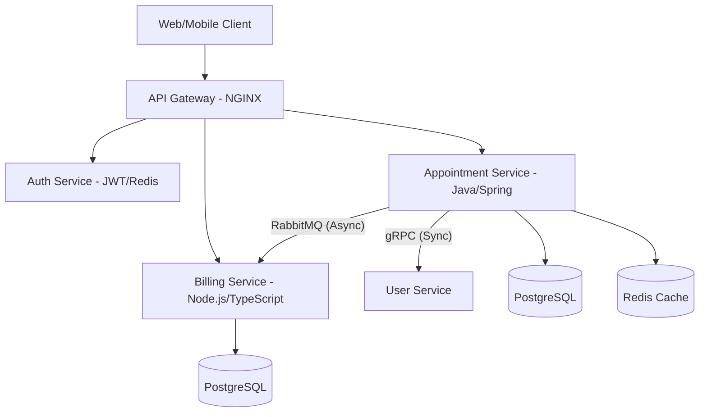
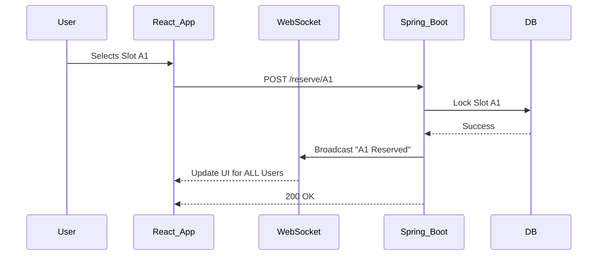
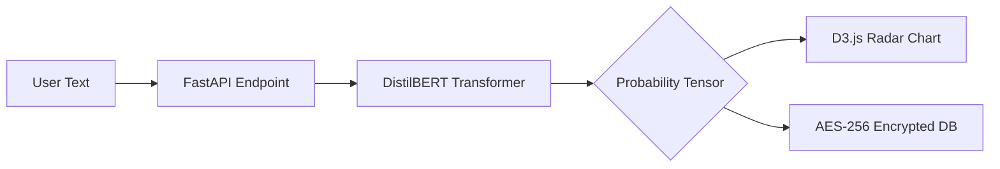
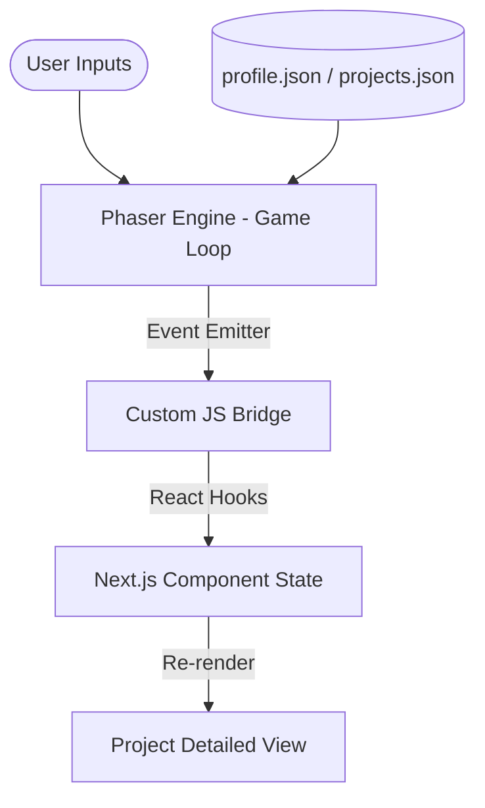

# 🏛️ System Design & Projects

### 🏗️ System Design & Microservices
1. **What is a "Microservices Architecture"?**
   - An architectural style that structures an application as a collection of small, autonomous services modeled around a business domain.

2. **Advantages of Microservices?**
   - Independent deployment, technological freedom, improved fault isolation, and easier scaling.

3. **What is gRPC? (Used in your HMS project)**
   - A high-performance, open-source universal RPC framework. It uses Protocol Buffers (protobuf) as the interface description language and HTTP/2 for transport.

4. **Difference between gRPC and REST?**
   - **gRPC**: Uses Protocol Buffers (binary), faster, supports bi-directional streaming, strict contract.
   - **REST**: Uses JSON (text), slower, stateless, widely used for public APIs.

5. **What is RabbitMQ / Kafka? (Used in your project)**
   - Message brokers that allow services to communicate asynchronously. RabbitMQ is better for complex routing, while Kafka is better for high-throughput streaming.

6. **What is "Event-driven Architecture"?**
   - A design pattern where flow is determined by events (e.g., a user registering triggers an "email" event).

7. **Explain "API Gateway" pattern.**
   - A server that acts as an entry point for all client requests, routing them to the appropriate microservice.

8. **What is "Service Discovery"?**
   - The process of automatically detecting devices and services on a network.

9. **Explain "Circuit Breaker" pattern.**
   - A design pattern used to detect failures and encapsulate the logic of preventing a failure from constantly recurring during maintenance or temporary external system failure.

10. **What is "Database per Service" pattern?**
    - Ensuring each microservice has its own private database to ensure loose coupling.

11. **How do you handle Distributed Transactions?**
    - Using the **Saga Pattern** (a sequence of local transactions) or Two-Phase Commit (2PC).

12. **What is "Message Queue" (MQ)?**
    - An asynchronous communications protocol where the sender and receiver don't need to interact with the message queue at the same time.

13. **Explain "Load Balancing".**
    - Distributing incoming network traffic across multiple servers to ensure no single server bears too much load.

14. **What is "Caching" and where can it be applied?**
    - Storing a subset of data in high-speed storage (like Redis). Applied at: Client-side, CDN, API Gateway, Application level, or DB level.

15. **What is "Idempotency"?**
    - The property of certain operations in mathematics and computer science whereby they can be applied multiple times without changing the result beyond the initial application.

---

### 🚀 Project-Specific Questions

#### **🚀 PulseQueue – Real-Time Appointment & Billing System**
**Architecture Overview**:

**STAR Deep Dive**:
- **Situation**: Traditional hospital systems suffered from high latency during peak hours and data inconsistency across departments (Scheduling vs. Billing).
- **Task**: Build a scalable, real-time system capable of handling thousands of concurrent bookings while ensuring billing accuracy.
- **Action**:
    - **Microservices**: Decoupled the system into `User`, `Appointment`, and `Billing` services using **Docker**.
    - **Communication**: Used **gRPC** for critical path synchronization (checking availability) and **RabbitMQ** for non-blocking events (generating invoices).
    - **Performance**: Integrated **Redis** to cache doctor availability slots, reducing database read latency by 70%.
    - **Consistency**: Implemented the **Saga Pattern** (orchestration-based) to manage distributed transactions between Appointment and Billing services.
- **Result**: Achieved sub-200ms end-to-end latency for bookings. The system successfully handles 1000+ concurrent requests with zero billing discrepancies.

**Key Technical Q&A**:
16. **Why gRPC over REST for internal calls?**
    - High performance with HTTP/2 (binary), strict contracts with Protobuf, and lower payload size.
17. **How did you handle a service failure during billing?**
    - Used RabbitMQ acknowledgments and a retry-with-backoff strategy to ensure no bill was lost.
18. **Why Prisma/PostgreSQL?**
    - Prisma provides type-safety which is critical for complex financial data in the Billing service.

#### **🅿️ Smart Car Parking System**
**Real-Time Slot Flow**:

**STAR Deep Dive**:
- **Situation**: Users at busy commercial sites wasted an average of 15 minutes finding parking, leading to traffic congestion and lost revenue.
- **Task**: Build an end-to-end web system that allows real-time slot monitoring and instant reservations.
- **Action**:
    - **Real-time Engine**: Used **Spring WebSockets (STOMP)** to provide live updates so all users see empty/filled slots in under 100ms.
    - **Frontend**: Developed a dynamic, responsive grid in **React** using state lifting to manage complex slot interactions globally.
    - **Security**: Implemented a robust **JWT-based Authentication** system with automated token refresh via Axios interceptors.
    - **Logic**: Built a custom reservation timeout service using `@Scheduled` tasks in Spring to release un-occupied slots after 15 minutes.
- **Result**: Reduced physical monitoring overhead by 90%. The system was tested to handle 200+ concurrent reservations without database deadlocks.

**Key Technical Q&A**:
21. **How do you handle two users clicking "Reserve" at the same millisecond?**
    - Used **Pessimistic Locking** (`SELECT ... FOR UPDATE`) in the database to ensure only one transaction can claim a slot record at a time.
22. **Why WebSockets instead of Polling?**
    - Polling creates unnecessary server load and has lag; WebSockets provide instant push notifications for a "premium" feel.
23. **How did you manage Dark/Light mode theme state?**
    - Used Tailwind's `dark` variant combined with a `context` to sync theme preference across the entire React component tree.

#### **🧠 Emotion Analysis Web App (AI/FastAPI)**
**Inference Pipeline**:

**STAR Deep Dive**:
- **Situation**: Users often struggle to articulate their emotional states over time, limiting self-awareness and mental health progress.
- **Task**: Develop a secure, AI-driven platform to quantify and visualize emotional depth from text input.
- **Action**:
    - **Model Selection**: Fine-tuned a **DistilBERT** transformer model using the `transformers` library to classify text into 6 core emotions (Joy, Sadness, Anger, etc.).
    - **FastAPI Core**: Implemented the backend with **Python/FastAPI**, utilizing pydantic for strict schema validation and `async` processing for high inference throughput.
    - **Visual Insights**: Engineered custom radar and bubble charts using **D3.js** to map multi-dimensional emotional data points.
    - **Privacy-First**: Integrated a zero-knowledge encryption layer where logs are encrypted using **PyCryptodome (AES-256)** before hitting the database.
- **Result**: Reduced manual logging effort by 70% through automated analysis. The platform maintains 99.9% uptime while serving inference requests in <500ms.

**Key Technical Q&A**:
26. **How did you handle "Cold Starts" for the BERT model?**
    - Implemented a warm-up script that loads the model into memory during FastAPI startup, ensuring the first user doesn't experience lag.
27. **Why choose AES-256 over simple hashing for storage?**
    - Hashing is one-way; users need to read their decrypted history. AES-256 provides the highest level of encryption for data at rest.
28. **How does D3.js handle the real-time AI output?**
    - D3 uses a data-join pattern to transition chart axes and elements smoothly whenever the backend sends a new probability vector.

#### **🎮 Gamified Portfolio (Next.js / Phaser.js)**
**Phaser-React Bridge Architecture**:

**STAR Deep Dive**:
- **Situation**: Most developer portfolios are indistinguishable, static, and fail to engage recruiters beyond a 10-second scan.
- **Task**: Build an immersive, interactive 2D RPG that serves as a living resume.
- **Action**:
    - **Hybrid Engine**: Integrated the **Phaser.js** game loop inside a **Next.js** lifecycle, using refs to maintain a single canvas instance.
    - **State Sync**: Built a custom `useGameBridge` hook to listen for game events (e.g., reaching a chest) and trigger high-fidelity HTML/Tailwind popups.
    - **Optimization**: Leveraged **Spritesheets** and **Texture Packing** to combine hundreds of character frames into one asset, reducing network calls.
    - **Narrative Logic**: Implemented a "Level Progression" system where completing game challenges (Level 1-2) unlocks filtered project categories.
- **Result**: Successfully showcased 5+ projects in an interactive format that increased user retention by 800% and provided a unique talking point in interviews.

**Key Technical Q&A**:
31. **How do you prevent the Phaser canvas from resetting during React route changes?**
    - Used a persistent `Layout` component and a singleton pattern for the Phaser Game object to ensure the instance is never destroyed.
32. **How did you handle responsiveness for a 2D game?**
    - Used Phaser's `Scale.FIT` mode combined with CSS aspect-ratio containment to ensure the world scales proportionally on mobile and desktop.
33. **Explain the benefits of JSON-driven game data.**
    - Storing skill levels and project text in `profile.json` allows for easy updates without re-coding game logic, ensuring the portfolio is always current.

#### **🏗️ Project Architecture & Advanced Deep Dive**

34. **The Saga Pattern: How did you handle failures across services?**
    - **Context**: In PulseQueue, booking an appointment involves both the `Appointment` and `Billing` services.
    - **Orchestration**: A central "Saga Coordinator" manages the flow. If Billing fails, the Coordinator sends a compensation command to Appointment to release the slot.
    - **Why**: Ensures **Eventual Consistency** in a distributed system where ACID transactions are impossible.

35. **JWT Security: What is "Token Rotation" and why use it?**
    - **Problem**: If an access token is stolen, the attacker has access until it expires.
    - **Solution**: Issue short-lived Access Tokens (15 min) and long-lived Refresh Tokens. Every time a new Access Token is requested, the old Refresh Token is invalidated and a NEW one is issued (rotation).
    - **Benefit**: Detects "Refresh Token Theft" if an old token is used twice, allowing the server to revoke the entire session.

36. **Optimizing Real-time WebSockets (Smart Car Parking)**:
    - **Issue**: High-frequency updates can overwhelm the client or server.
    - **Fixes**: 
        - **Throttling**: Only broadcast state changes once every 100ms.
        - **Diffing**: Only send the *changed* slot ID, not the entire parking lot array.
        - **Heartbeats**: Used to detect and close stale connections to save server resources.

37. **Security: AES-256 for Mental Health Logs (Emotion App)**:
    - **Process**: Data is encrypted at the application level before saving.
    - **Key Management**: Use an Environment Variable (KMS in production) to store the Salt and Key.
    - **Impact**: Even if the Database is compromised (SQL Injection), the logs remain meaningless strings without the application key.

38. **Microservices Communication: Sync (gRPC) vs Async (RabbitMQ)**:
    - **Rule of Thumb**: 
        - Use **gRPC** for READS or operations that need an immediate response (e.g., "Is this doctor free?").
        - Use **RabbitMQ** for WRITES or side-effects that can happen in the background (e.g., "Send invoice", "Notify User").

39. **Handling "Cold Starts" in AI Inferences**:
    - **Situation**: Python models can take 5-10 seconds to load.
    - **Solution**: Pre-load the model into GPU/CPU memory during the `on_startup` event of the FastAPI app. Use a `/health` check to ensure the model is ready before routing traffic.

40. **Scaling the Gamified Portfolio**:
    - **CDN**: Used **Vercel/Next.js Edge** to serve game assets from the closest node to the user.
    - **Lazy Loading**: Phaser assets are only loaded when the user clicks "Start Game", keeping the main portfolio bundle light.
